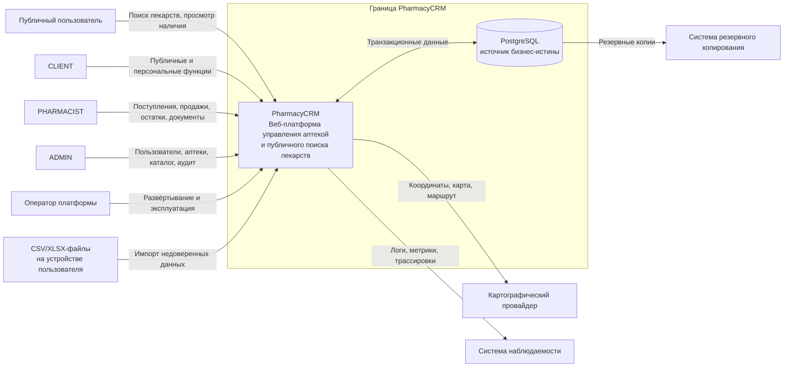

# PharmacyCRM — System Context

**Статус документа:** Draft  
**Версия:** 0.1  
**Дата:** 2026-07-17

## 1. Назначение документа

Документ определяет системные границы PharmacyCRM, участников взаимодействия, внешние зависимости, основные информационные потоки и границы доверия.

Он отвечает на вопросы:

- кто взаимодействует с PharmacyCRM;
- какие функции находятся внутри ответственности системы;
- какие функции делегируются внешним системам;
- какие данные пересекают системную границу;
- какие взаимодействия являются критическими;
- какие внешние интеграции входят и не входят в MVP;
- где проходят основные границы доверия и отказоустойчивости.

Документ не описывает внутреннюю структуру модулей, слоёв и компонентов backend. Эти решения фиксируются в `04-architecture.md` и соответствующих ADR.

## 2. Связь с другими документами

System Context уточняет контекст, заданный в:

- `01-product-vision.md` — продуктовая цель, рынок и границы MVP;
- `02-srs.md` — обязательное внешнее поведение и требования;
- ADR — архитектурно значимые решения;
- будущих документах по архитектуре, API, данным, безопасности, развёртыванию и тестированию.

При противоречии применяется порядок приоритетов, установленный в SRS.

## 3. Краткое описание системы

PharmacyCRM — веб-платформа для управления небольшой аптекой и публичного поиска лекарств на локальном рынке Республики Таджикистан.

Система объединяет два связанных контура:

1. **Внутренний операционный контур аптеки** — управление ассортиментом, поступлениями, лотами, остатками, продажами, возвратами, списаниями, корректировками, предупреждениями и аудитом.
2. **Публичный контур поиска** — поиск препарата и отображение аптек, в которых имеется доступный непросроченный остаток.

В MVP одна аптека соответствует одной физической точке продажи и хранения. Сети аптек, несколько складов внутри одной организации и перемещения между точками не входят в текущую системную границу.

## 4. Системная граница

### 4.1 Внутри ответственности PharmacyCRM

PharmacyCRM отвечает за:

- аутентификацию пользователей;
- авторизацию по ролям и назначению аптекаря конкретной аптеке;
- управление пользователями и аптеками;
- ведение глобального каталога лекарств;
- staging, валидацию, нормализацию и модерацию импортируемого каталога;
- ведение ассортимента конкретной аптеки;
- учёт поставок и лотов;
- хранение и изменение складских остатков;
- применение FEFO при продаже;
- проведение продаж, возвратов, списаний и корректировок;
- расчёт итоговых количеств и денежных сумм на backend;
- идемпотентное выполнение критических команд;
- формирование неизменяемых складских движений;
- сохранение исторических снимков значимых данных;
- публикацию доступного остатка для публичного поиска;
- предупреждения о низких остатках и сроках годности;
- рекомендации по ручному пополнению;
- регистрацию аудита критических действий;
- экспорт и отображение операционных данных в пределах определённых API и пользовательских интерфейсов.

### 4.2 Вне ответственности PharmacyCRM в MVP

В MVP PharmacyCRM не отвечает за:

- бухгалтерский и налоговый учёт полного цикла;
- государственную маркировку лекарств;
- автоматическое взаимодействие с государственными реестрами;
- автоматическую проверку электронных рецептов во внешней государственной системе;
- фискализацию через кассовые аппараты;
- эквайринг и приём онлайн-платежей;
- управление закупками у поставщиков как внешним электронным процессом;
- автоматическое размещение заказов поставщикам;
- логистику и доставку лекарств клиенту;
- перемещение товаров между аптеками;
- управление несколькими складами одной аптеки;
- полноценную CRM-модель маркетинга, рассылок и программ лояльности;
- медицинскую диагностику или рекомендации по лечению;
- подтверждение медицинской корректности назначения препарата;
- работу без доступного backend и PostgreSQL во время критических операций.

Эти возможности могут быть добавлены позднее только после отдельного уточнения SRS, системного контекста, модели угроз и архитектурных решений.

## 5. Участники системы

### 5.1 Публичный пользователь

Публичный пользователь не проходит обязательную аутентификацию и взаимодействует только с публичным контуром.

Основные цели:

- найти препарат;
- выбрать форму выпуска, дозировку и представление;
- увидеть аптеки с доступным непросроченным остатком;
- сравнить цену и расстояние;
- получить адрес, ориентир, телефон, график работы и время актуальности данных;
- открыть маршрут до выбранной аптеки.

Публичный пользователь считается недоверенным внешним субъектом. Все входные параметры поиска должны валидироваться, ограничиваться и безопасно обрабатываться.

### 5.2 CLIENT

`CLIENT` — авторизованный пользователь публичного контура.

В MVP базовый поиск не зависит от регистрации. Роль создаёт основу для будущих персональных функций, но не должна расширять доступ к внутренним данным аптек.

### 5.3 PHARMACIST

`PHARMACIST` — аптекарь, работающий с одной назначенной аптекой.

Основные цели:

- поддерживать ассортимент;
- регистрировать поступления и лоты;
- проводить продажи;
- оформлять допустимые возвраты, списания и корректировки;
- контролировать остатки и сроки годности;
- получать предупреждения и рекомендации;
- выполнять первичный импорт остатков;
- редактировать публичную информацию своей аптеки.

Токен аптекаря не является достаточным доказательством права работать с произвольной аптекой. Backend обязан повторно проверять актуальную роль, состояние пользователя и назначение аптеке.

### 5.4 ADMIN

`ADMIN` — системный администратор и модератор глобальных данных.

Основные цели:

- управлять аптеками и пользователями;
- назначать аптекарей;
- управлять глобальным каталогом;
- импортировать данные в staging;
- модерировать совпадения и дубликаты;
- публиковать подтверждённые карточки;
- просматривать аудит;
- расследовать инциденты;
- выполнять только явные корректирующие операции.

Администратор обладает расширенными полномочиями, но не имеет права незаметно переписывать историю проведённых операций.

### 5.5 Оператор платформы

Оператор платформы — технический персонал, отвечающий за эксплуатацию PharmacyCRM.

Он взаимодействует не с бизнес-функциями, а с эксплуатационным контуром:

- развёртывание;
- конфигурация;
- управление секретами;
- резервное копирование и восстановление;
- мониторинг;
- анализ журналов и метрик;
- реагирование на технические инциденты.

Оператор платформы не должен автоматически получать бизнес-права `ADMIN`. Эксплуатационные и прикладные полномочия должны рассматриваться как разные контуры доступа.

## 6. Внешние системы и зависимости

### 6.1 Картографический провайдер

Картографический провайдер используется для:

- отображения аптек на карте;
- визуального выбора или проверки координат;
- открытия маршрута;
- возможного расчёта расстояния, если это предусмотрено выбранным способом интеграции.

PharmacyCRM должна хранить подтверждённые координаты аптеки независимо от конкретного провайдера.

Картографический провайдер не является источником истины для:

- наличия товара;
- цены;
- статуса аптеки;
- формального адреса и ориентира после их подтверждения в PharmacyCRM.

Недоступность карты не должна повреждать операционные данные. При возможности пользователь должен продолжать видеть текстовый адрес, ориентир и телефон.

### 6.2 Пользовательская файловая система

Файловая система устройства пользователя выступает внешним источником CSV/XLSX-файлов для:

- импорта каталога в staging;
- первичного импорта ассортимента и остатков по утверждённому шаблону.

Загруженный файл является недоверенным входом. PharmacyCRM обязана:

- ограничивать размер и допустимые типы файла;
- проверять фактический формат, а не только расширение;
- безопасно разбирать содержимое;
- валидировать каждую строку;
- не публиковать данные напрямую без предусмотренной проверки;
- формировать отчёт об ошибках;
- исключать выполнение формул, макросов или встроенного активного содержимого.

### 6.3 PostgreSQL

PostgreSQL является основной операционной базой данных PharmacyCRM и источником истины для бизнес-состояния.

Через PostgreSQL обеспечиваются:

- долговременное хранение;
- транзакционная атомарность;
- блокировки конкурентных операций;
- уникальные ограничения;
- ссылочная целостность;
- хранение неизменяемых движений и аудита;
- идемпотентность критических команд.

Недоступность PostgreSQL означает невозможность безопасного проведения критических складских и торговых операций. Система должна завершать такие запросы ошибкой, а не имитировать успешное выполнение.

PostgreSQL входит в технический контур PharmacyCRM, но остаётся отдельной зоной доверия и отказа.

### 6.4 Система наблюдаемости

Эксплуатационная среда может включать внешние или самостоятельно размещённые средства сбора:

- структурированных журналов;
- метрик;
- трассировок;
- уведомлений о технических инцидентах.

Конкретный стек определяется в `14-observability.md` и `12-deployment.md`.

В систему наблюдаемости запрещено без необходимости передавать:

- пароли;
- токены;
- секреты;
- полное содержимое загруженных файлов;
- избыточные персональные данные;
- чувствительные данные, не требуемые для диагностики.

### 6.5 Система резервного копирования

Средства резервного копирования получают контролируемый доступ к данным PostgreSQL или к подготовленным резервным копиям.

Они должны обеспечивать:

- шифрование при передаче и хранении;
- ограниченный доступ;
- проверяемое восстановление;
- согласованные RPO и RTO.

`RPO` — максимально допустимый объём потерянных данных по времени.  
`RTO` — максимально допустимое время восстановления сервиса.

Конкретные значения определяются в документации по развёртыванию и эксплуатации.

## 7. Системная контекстная диаграмма

Диаграмма показывает контекст верхнего уровня. Внутренние контейнеры frontend, backend, workers и другие компоненты будут определены в архитектурном документе.

## 8. Основные информационные потоки

### 8.1 Публичный поиск лекарства

1. Публичный пользователь отправляет поисковый запрос.
2. PharmacyCRM валидирует и нормализует параметры.
3. Система находит опубликованные представления препаратов.
4. Система выбирает активные аптеки с доступным непросроченным остатком.
5. Backend возвращает цену, статус наличия, данные аптеки и время актуальности.
6. Пользователь может открыть аптеку на карте или построить маршрут через картографического провайдера.

Публичный ответ не должен раскрывать внутренние лоты, закупочные цены, пользователей аптеки, аудит или другие операционные данные.

### 8.2 Проведение поступления

1. Аптекарь аутентифицируется.
2. Backend повторно проверяет пользователя и назначение аптеке.
3. Аптекарь создаёт или редактирует черновик поступления.
4. При проведении backend валидирует состав документа.
5. В одной бизнес-транзакции создаются лоты, изменяются остатки, формируются движения и фиксируется аудит.
6. После успешного commit результат становится видимым другим операциям.

Частично проведённое поступление недопустимо.

### 8.3 Проведение продажи

1. Аптекарь формирует продажу.
2. Backend проверяет доступ и повторно вычисляет итоговые количества и суммы.
3. Система выбирает допустимые лоты по FEFO.
4. В одной транзакции блокируются необходимые данные, уменьшаются остатки, создаются движения, сохраняется продажа и аудит.
5. После commit обновлённый остаток становится доступен публичному поиску.

Frontend не является источником истины для цены, суммы, состава списания и выбора лотов.

### 8.4 Импорт глобального каталога

1. Администратор загружает файл.
2. Система проверяет формат и структуру.
3. Строки помещаются в staging.
4. Выполняются нормализация и поиск кандидатов на дублирование.
5. Администратор принимает решение по сопоставлению или созданию карточки.
6. Только подтверждённая запись публикуется в глобальном каталоге.

Файл не должен напрямую изменять опубликованный каталог в обход staging и модерации.

### 8.5 Импорт начальных остатков

1. Аптекарь загружает файл утверждённого формата.
2. Система проверяет аптеку, пользователя, формат и каждую строку.
3. Пользователю возвращается предварительный результат проверки.
4. После явного подтверждения система создаёт контролируемую бизнес-операцию импорта.
5. Лоты, остатки, движения и аудит фиксируются согласованно.

Импорт не должен превращаться в прямое массовое обновление таблиц без доменных проверок.

### 8.6 Эксплуатационные данные

1. Backend и фоновые процессы формируют структурированные события наблюдаемости.
2. Система удаляет или маскирует секреты и избыточные чувствительные данные.
3. События отправляются в эксплуатационный контур.
4. Оператор использует их для диагностики и реагирования.

Система наблюдаемости не является источником истины для бизнес-состояния.

## 9. Границы доверия

### 9.1 Интернет → публичный интерфейс

Все запросы из интернета считаются недоверенными.

Необходимы:

- TLS;
- ограничение размера запросов;
- таймауты;
- rate limiting для чувствительных и ресурсоёмких операций;
- строгая валидация;
- безопасная обработка ошибок;
- защита от автоматизированного злоупотребления;
- отсутствие внутренних деталей в ответах.

### 9.2 Авторизованный пользователь → защищённый API

Наличие действительного токена подтверждает только результат аутентификации в пределах политики сессии.

Для каждой защищённой операции backend обязан проверить:

- существование пользователя;
- актуальное состояние пользователя;
- блокировку или архивирование;
- текущую роль;
- принадлежность аптекаря нужной аптеке;
- разрешение на конкретную операцию;
- допустимость перехода состояния доменного объекта.

### 9.3 Frontend → backend

Frontend считается недоверенным клиентом, даже если разработан в том же проекте.

Backend не должен доверять переданным клиентом:

- итоговым суммам;
- рассчитанным ценам;
- доступному остатку;
- выбранным для списания лотам;
- роли пользователя;
- `pharmacy_id` без повторной проверки;
- времени проведения;
- статусу документа;
- признаку успешности предыдущей операции.

### 9.4 Backend → PostgreSQL

Соединение с PostgreSQL проходит отдельную границу доверия.

Требуются:

- отдельный пользователь БД с минимально необходимыми правами;
- защищённое хранение строки подключения;
- шифрование соединения в средах, где сеть не считается доверенной;
- ограниченный сетевой доступ;
- миграции под контролем версий;
- явные транзакции для бизнес-операций;
- ограничения целостности как дополнительный уровень защиты.

### 9.5 PharmacyCRM → картографический провайдер

Картографический провайдер является внешней системой.

Необходимо:

- минимизировать передаваемые данные;
- не передавать внутренние складские данные;
- учитывать таймауты и недоступность;
- не считать ответ провайдера основанием для изменения подтверждённых координат без явного действия пользователя;
- изолировать провайдера за заменяемым интеграционным контрактом.

### 9.6 Загруженный файл → контур импорта

CSV/XLSX-файл считается полностью недоверенным содержимым.

Контур импорта должен быть изолирован от непосредственного проведения операций до завершения проверки и подтверждения.

### 9.7 Приложение → эксплуатационный контур

Логи, метрики, трассировки и резервные копии покидают основной прикладной процесс и требуют отдельной политики доступа, хранения и удаления.

## 10. Критичность взаимодействий

### 10.1 Критические синхронные операции

К критическим относятся операции, создающие складской, финансовый или юридически значимый эффект:

- проведение поступления;
- проведение продажи;
- возврат;
- списание;
- корректировка;
- сторнирование;
- публикация импортированных данных;
- изменение полномочий пользователей;
- блокировка пользователя или аптеки.

Для них обязательны:

- аутентификация и авторизация;
- повторная серверная валидация;
- атомарная транзакция;
- идемпотентность там, где повтор запроса реалистичен;
- аудит;
- однозначный результат commit или rollback.

### 10.2 Некритические или деградируемые взаимодействия

К ним относятся:

- отображение карты;
- построение маршрута;
- часть аналитических представлений;
- техническая телеметрия;
- некритические фоновые рекомендации.

Их временная недоступность не должна повреждать бизнес-состояние или приводить к ложному подтверждению критической операции.

## 11. Синхронные и асинхронные взаимодействия

### 11.1 Синхронные взаимодействия MVP

Синхронно выполняются:

- аутентификация;
- публичный поиск;
- чтение операционных данных;
- создание и редактирование черновиков;
- проведение критических документов;
- административные команды;
- загрузка файла и первичная валидация в пределах допустимого размера.

Пользователь должен получить явный результат операции в рамках HTTP-запроса, если SRS не определяет иной процесс.

### 11.2 Допустимые фоновые процессы

В фоне могут выполняться:

- пересчёт предупреждений;
- формирование рекомендаций по пополнению;
- обработка крупных импортов после безопасной регистрации задания;
- очистка временных данных;
- агрегирование эксплуатационных метрик;
- плановые резервные копии.

Фоновый процесс не должен обходить доменные инварианты. Если он меняет бизнес-состояние, он обязан использовать те же правила транзакций, авторизации системного инициатора, идемпотентности и аудита, что и синхронный use case.

### 11.3 Очередь сообщений

Внешний брокер сообщений не считается обязательной зависимостью MVP.

Его добавление допустимо только при наличии конкретной эксплуатационной или функциональной потребности и после ADR, определяющего:

- гарантии доставки;
- повторную обработку;
- идемпотентность consumer;
- порядок сообщений;
- dead-letter handling;
- наблюдаемость;
- восстановление после сбоя.

## 12. Данные, пересекающие системную границу

### 12.1 Входящие данные

В систему поступают:

- учётные данные пользователя;
- поисковые запросы;
- команды аптекаря и администратора;
- данные документов;
- сведения о препаратах и упаковках;
- цены и количества;
- данные аптек;
- координаты;
- CSV/XLSX-файлы;
- idempotency key;
- технические метаданные запроса.

### 12.2 Исходящие данные

Из системы выдаются:

- результаты публичного поиска;
- публичные данные аптек;
- операционные документы;
- остатки и движения в разрешённом объёме;
- предупреждения;
- рекомендации;
- результаты импорта;
- административные представления;
- аудит в пределах полномочий;
- технические логи, метрики и трассировки;
- резервные копии.

### 12.3 Ограничение раскрытия данных

Каждый API и интерфейс должен возвращать только данные, необходимые текущему субъекту и сценарию.

Публичный контур не должен раскрывать:

- закупочные цены;
- номера внутренних документов;
- внутренние идентификаторы пользователей;
- персональные данные сотрудников;
- детальную структуру лотов сверх публичной необходимости;
- аудит;
- технические сведения об инфраструктуре.

## 13. Владение данными и источники истины

| Данные | Источник истины | Дополнительное правило |
|---|---|---|
| Пользователи, роли, блокировки | PharmacyCRM / PostgreSQL | Токен не заменяет повторную проверку актуального состояния |
| Аптеки и назначения аптекарей | PharmacyCRM / PostgreSQL | Назначение проверяется для каждой защищённой операции |
| Глобальный каталог | PharmacyCRM / PostgreSQL | Внешний файл является только источником кандидатов через staging |
| Ассортимент и цены аптеки | PharmacyCRM / PostgreSQL | История документов хранит снимки значимых значений |
| Лоты и остатки | PharmacyCRM / PostgreSQL | Остатки меняются только через доменные операции и движения |
| Продажи, возвраты, списания | PharmacyCRM / PostgreSQL | Проведённые документы не переписываются как черновики |
| Координаты аптеки | PharmacyCRM / PostgreSQL | Карта помогает выбрать координаты, но не владеет ими |
| Маршрут и визуализация карты | Картографический провайдер | Не являются источником бизнес-состояния |
| Логи и метрики | Система наблюдаемости | Не являются источником истины для операций |
| Резервные копии | Система резервного копирования | Используются только для восстановления контролируемым процессом |

## 14. Отказовые сценарии на границе системы

### 14.1 Недоступен картографический провайдер

Ожидаемое поведение:

- операционные функции аптеки продолжают работать;
- публичный поиск может вернуть текстовые данные без карты;
- подтверждённые координаты не изменяются;
- пользователь получает понятное сообщение о временной недоступности карты.

### 14.2 Недоступен PostgreSQL

Ожидаемое поведение:

- критические операции отклоняются;
- система не возвращает ложный успех;
- незавершённая транзакция откатывается;
- ошибка регистрируется без утечки секретов;
- восстановление выполняется эксплуатационным контуром.

### 14.3 Некорректный импортируемый файл

Ожидаемое поведение:

- опубликованные данные и остатки не изменяются;
- пользователю возвращается отчёт об ошибках;
- допустимые и недопустимые строки обрабатываются согласно выбранной политике импорта;
- повторная загрузка не создаёт скрытых дублей.

### 14.4 Повтор критического запроса

Ожидаемое поведение:

- тот же idempotency key и тот же смысловой payload возвращают исходный результат;
- тот же ключ и другой смысловой payload отклоняются как конфликт;
- складской или финансовый эффект не применяется повторно.

### 14.5 Истёкшая или отозванная сессия

Ожидаемое поведение:

- защищённый запрос отклоняется;
- блокировка пользователя применяется в пределах установленной политики сессий;
- повторная проверка актуального состояния предотвращает использование устаревших полномочий.

## 15. Ограничения MVP, влияющие на контекст

1. Одна аптека — одна физическая точка продажи и хранения.
2. Аптекарь работает только с назначенной аптекой.
3. Публичный поиск доступен без регистрации.
4. PostgreSQL обязателен для критических операций.
5. Внешний официальный каталог лекарств не является гарантированной зависимостью.
6. Основной путь наполнения каталога — управляемый импорт через staging и модерацию.
7. Картографический провайдер должен быть заменяемым.
8. Интеграции с фискальными устройствами, государственными системами и поставщиками не входят в MVP.
9. Внешний брокер сообщений не является обязательным компонентом MVP.
10. Система не является медицинской экспертной системой и не назначает лечение.

## 16. Будущие внешние интеграции

Следующие интеграции рассматриваются только как направления развития:

- государственный реестр лекарственных средств;
- электронные рецепты;
- системы маркировки и прослеживаемости;
- фискальные устройства;
- платёжные провайдеры;
- API поставщиков;
- электронный заказ и доставка;
- SMS, email и push-провайдеры;
- системы лояльности;
- внешние BI-платформы;
- межаптечный обмен данными.

Ни одна из этих систем не должна неявно появляться как обязательная зависимость реализации MVP.

Перед добавлением интеграции требуется:

1. обновить Product Vision и SRS;
2. определить владельца данных;
3. описать отказовые сценарии;
4. определить модель аутентификации и доверия;
5. определить требования к идемпотентности и повторной обработке;
6. провести анализ безопасности и конфиденциальности;
7. принять ADR;
8. обновить архитектурные и эксплуатационные документы.

## 17. Архитектурные следствия

Из системного контекста следуют базовые ограничения для дальнейшей архитектуры:

1. Backend является единственной доверенной точкой применения бизнес-правил.
2. PostgreSQL является источником истины для операционного состояния.
3. Публичный и внутренний контуры используют общие доменные данные, но имеют разные модели доступа и раскрытия информации.
4. Критические операции должны быть транзакционными и идемпотентными.
5. Контур импорта должен быть отделён от опубликованных и проведённых данных.
6. Внешние провайдеры должны подключаться через заменяемые адаптеры.
7. Недоступность внешнего провайдера не должна повреждать бизнес-состояние.
8. Авторизация должна учитывать актуальное состояние пользователя и назначение аптеке, а не только claims токена.
9. Эксплуатационные полномочия не должны автоматически означать прикладную роль администратора.
10. Архитектура должна оставлять возможность дальнейшего выделения фоновых процессов без нарушения доменных инвариантов.

Эти следствия будут детализированы в `04-architecture.md`.

## 18. Открытые вопросы

До production-запуска должны быть закрыты следующие вопросы:

1. Какой картографический провайдер используется в первой среде и каковы его условия лицензирования?
2. Выполняется ли расчёт расстояния на стороне PharmacyCRM или картографического провайдера?
3. Каковы допустимые лимиты CSV/XLSX-файлов и максимальное число строк импорта?
4. Какие персональные данные пользователей обязательны для MVP и каковы сроки их хранения?
5. Каковы целевые RPO и RTO?
6. Какой срок хранения установлен для аудита, технических логов и результатов импорта?
7. Требуется ли антивирусная проверка загружаемых файлов в первой production-среде?
8. Какие юридические правила применяются к возвратам лекарственных средств и фиксации подтверждения рецепта?
9. Требуется ли отдельный режим ограниченной работы при временной потере интернета?
10. Какие данные публичного наличия допустимо кэшировать и каков максимальный срок их устаревания?

Открытые вопросы не отменяют уже установленные инварианты. Решения по ним должны быть отражены в SRS, ADR или профильном техническом документе.

## 19. Критерии готовности документа

Документ считается готовым к утверждению, когда:

- границы MVP согласованы с Product Vision и SRS;
- все пользовательские роли представлены;
- внешние системы и технические зависимости перечислены;
- определены владельцы основных данных;
- основные информационные потоки описаны;
- границы доверия зафиксированы;
- отказовые сценарии не противоречат требованиям;
- будущие интеграции явно отделены от MVP;
- открытые вопросы назначены на профильные документы или ADR.

## 20. Итог

PharmacyCRM является системой учёта и публикации аптечных данных, внутри которой backend и PostgreSQL образуют доверенное ядро бизнес-операций. Пользовательские интерфейсы, загружаемые файлы и внешние провайдеры находятся за отдельными границами доверия и не могут напрямую определять бизнес-состояние.

Контекст MVP намеренно ограничен: система управляет одной физической аптекой как одной точкой хранения, поддерживает публичный поиск и не зависит от государственных, фискальных, платёжных или поставщицких интеграций. Такое ограничение позволяет перейти к проектированию внутренней архитектуры без скрытых внешних зависимостей и преждевременного усложнения.
