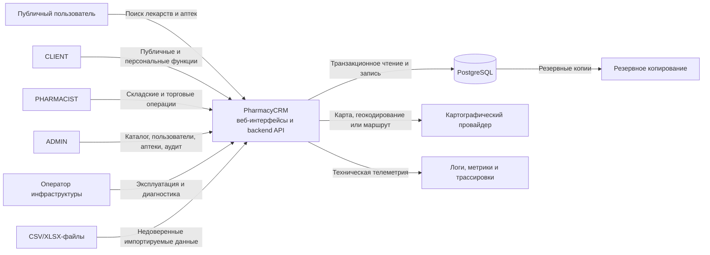

# PharmacyCRM — System Context

**Статус документа:** Draft  
**Версия:** 0.2  
**Дата:** 2026-07-17

## 1. Назначение документа

Документ определяет системную границу PharmacyCRM, участников взаимодействия, внешние зависимости, основные информационные потоки, источники истины, границы доверия и ожидаемое поведение при недоступности зависимостей.

Он отвечает на вопросы:

- кто взаимодействует с PharmacyCRM;
- какие функции и данные находятся внутри ответственности системы;
- какие функции делегируются внешним системам или людям;
- какие данные пересекают системную границу;
- какие взаимодействия являются критическими для проведения операций;
- какие внешние интеграции входят и не входят в MVP;
- где проходят основные границы доверия и отказоустойчивости.

Документ описывает PharmacyCRM как единое программное решение и не определяет внутреннюю структуру модулей, слоёв и компонентов backend. Эти решения фиксируются в `04-architecture.md` и соответствующих ADR.

## 2. Связь с другими документами

System Context уточняет контекст, заданный в:

- `01-product-vision.md` — продуктовая цель, рынок и границы MVP;
- `02-srs.md` — обязательное внешнее поведение и требования;
- ADR — принятые архитектурно значимые решения;
- последующих документах по архитектуре, API, данным, безопасности, развёртыванию, наблюдаемости и тестированию.

При противоречии применяется порядок приоритетов, установленный в SRS. System Context не должен незаметно расширять или сокращать продуктовые требования.

## 3. Краткое описание системы

PharmacyCRM — веб-платформа для управления небольшой аптекой и публичного поиска лекарств на локальном рынке Республики Таджикистан.

Система объединяет два связанных контура:

1. **Внутренний операционный контур аптеки** — управление ассортиментом, поступлениями, лотами, остатками, продажами, возвратами, списаниями, корректировками, предупреждениями и аудитом.
2. **Публичный контур поиска** — поиск препарата и отображение аптек, в которых имеется доступный непросроченный остаток.

В MVP одна аптека соответствует одной физической точке продажи и хранения. Сети аптек, несколько складов внутри одной организации и перемещения между точками не входят в текущую системную границу.

## 4. Системная граница

### 4.1 Внутри ответственности PharmacyCRM

PharmacyCRM отвечает за:

- аутентификацию пользователей;
- авторизацию по роли, состоянию аккаунта и назначению аптекаря конкретной аптеке;
- управление пользователями, назначениями и аптеками;
- ведение глобального каталога лекарств;
- staging, валидацию, нормализацию и модерацию импортируемого каталога;
- ведение ассортимента конкретной аптеки;
- регистрацию поставок и поставочных лотов;
- хранение и изменение складских остатков;
- применение FEFO при продаже;
- проведение продаж, возвратов, списаний и корректировок;
- расчёт итоговых количеств и денежных сумм на backend;
- идемпотентное выполнение критических команд;
- формирование неизменяемых складских движений;
- сохранение исторических снимков значимых данных;
- публикацию доступного остатка для публичного поиска;
- предупреждения о низких остатках и сроках годности;
- рекомендации по ручному пополнению;
- регистрацию аудита критических действий;
- импорт и экспорт данных только через явно определённые форматы и сценарии;
- предоставление пользовательских интерфейсов и API в пределах утверждённых требований.

### 4.2 Вне ответственности PharmacyCRM в MVP

В MVP PharmacyCRM не отвечает за:

- бухгалтерский и налоговый учёт полного цикла;
- государственную маркировку лекарств;
- автоматическое взаимодействие с государственными реестрами;
- автоматическую проверку электронных рецептов во внешней государственной системе;
- медицинскую диагностику и выдачу рекомендаций пациенту;
- замену профессионального решения аптекаря о допустимости отпуска препарата;
- фискализацию через кассовые аппараты;
- эквайринг и приём онлайн-платежей;
- управление банковскими транзакциями;
- автоматическое оформление заказов у поставщиков;
- управление логистикой и доставкой;
- автоматическую синхронизацию с учётными системами поставщиков;
- хранение или обработку медицинских карт пациентов;
- гарантирование достоверности исходных данных, введённых уполномоченным сотрудником, до прохождения предусмотренной валидации и модерации;
- работу кассы и критических складских операций без доступного backend и PostgreSQL.

### 4.3 Будущие расширения за пределами MVP

Следующие возможности могут быть добавлены позднее, но не должны неявно влиять на архитектуру и обязательства MVP:

- аптечные сети и несколько складов;
- перемещения между аптеками и складами;
- интеграция с фискальными регистраторами;
- интеграция с государственными каталогами, маркировкой и электронными рецептами;
- интеграция с поставщиками и автоматическое формирование заказов;
- онлайн-бронирование и онлайн-оплата;
- уведомления через SMS, email или мессенджеры;
- доставка лекарств;
- мобильные приложения;
- внешняя аналитическая платформа или хранилище данных.

Добавление такой интеграции требует отдельного изменения требований, анализа данных и безопасности, а при архитектурной значимости — нового ADR.

## 5. Участники взаимодействия

### 5.1 Публичный пользователь

Неавторизованный посетитель использует публичный веб-интерфейс для поиска препаратов и аптек с доступным остатком.

Он передаёт системе:

- поисковый запрос;
- выбранную форму, дозировку и другие фильтры;
- при добровольном разрешении — приблизительное местоположение для сортировки по расстоянию.

Он получает:

- сведения о препарате и его представлении;
- список аптек с доступным остатком;
- цену и статус наличия;
- адрес, ориентир, телефон, график работы;
- время актуальности опубликованных данных;
- ссылку или действие для открытия маршрута во внешнем картографическом сервисе.

Публичный пользователь не является доверенным источником складских, ценовых или каталожных данных.

### 5.2 CLIENT

`CLIENT` — авторизованный клиент системы. В MVP публичный поиск не зависит от регистрации, а персональные возможности могут развиваться отдельно.

Роль `CLIENT` не получает доступа к внутренним складским документам, точным служебным остаткам, закупочным ценам, аудиту и административным функциям.

### 5.3 PHARMACIST

`PHARMACIST` выполняет операционные действия только в назначенной ему аптеке:

- управляет локальным ассортиментом и разрешёнными ценами;
- регистрирует поступления и лоты;
- проводит продажи;
- оформляет разрешённые возвраты, списания и корректировки;
- просматривает остатки, лоты, движения, предупреждения и рекомендации;
- импортирует начальные остатки по утверждённому шаблону;
- редактирует разрешённые публичные сведения своей аптеки.

Назначение аптекаря аптеке является серверным ограничением доступа. Переданный клиентом `pharmacy_id`, маршрут frontend или содержимое токена сами по себе не дают права выполнить операцию.

### 5.4 ADMIN

`ADMIN` управляет системными справочниками и административными процессами:

- создаёт, блокирует и архивирует аптеки и пользователей;
- назначает аптекарей аптекам;
- управляет глобальным каталогом;
- загружает каталог в staging;
- модерирует совпадения и дубликаты;
- публикует подтверждённые карточки;
- просматривает аудит и расследует инциденты;
- выполняет только явно определённые корректирующие операции.

Административная роль не даёт права незаметно переписывать проведённые документы, складские движения или историю операций.

### 5.5 Оператор инфраструктуры

Оператор инфраструктуры развёртывает и обслуживает техническую среду PharmacyCRM:

- управляет конфигурацией и секретами;
- контролирует доступность приложений и PostgreSQL;
- выполняет резервное копирование и восстановление;
- получает технические метрики, логи и оповещения;
- выполняет регламентные действия по инцидентам.

Оператор инфраструктуры не считается бизнес-ролью PharmacyCRM и не должен использовать прямой доступ к БД как штатный способ изменения бизнес-данных.

## 6. Внешние системы и зависимости

### 6.1 Веб-браузер

Публичные пользователи и сотрудники взаимодействуют с PharmacyCRM через браузер. Браузер является недоверенной средой:

- запросы и поля могут быть изменены пользователем;
- frontend-код может быть подменён или вызван вне штатного интерфейса;
- локальное хранилище и состояние браузера не являются источником истины;
- все права, суммы, количества, статусы и переходы повторно проверяются backend.

### 6.2 PostgreSQL

PostgreSQL является основной транзакционной системой хранения и источником истины для:

- пользователей, ролей и назначений;
- аптек и глобального каталога;
- ассортимента, поставок, лотов и остатков;
- продаж, возвратов, списаний и корректировок;
- складских движений и идемпотентности;
- аудита и операционных состояний.

Критическая операция, меняющая остатки или создающая финансовый эффект, не считается проведённой до успешного завершения транзакции PostgreSQL.

### 6.3 Картографический провайдер

Внешний картографический провайдер может использоваться для:

- отображения карты;
- выбора или проверки координат аптеки;
- открытия маршрута;
- опционального геокодирования адреса.

Картографический провайдер не является источником истины для подтверждённых координат аптеки. Автоматическое геокодирование не должно незаметно заменять координаты, подтверждённые уполномоченным сотрудником.

Недоступность картографического провайдера не должна блокировать складские и торговые операции. Публичный интерфейс должен по возможности сохранить текстовый адрес, ориентир, телефон и другие доступные сведения.

### 6.4 Файлы импорта

CSV/XLSX-файлы используются для управляемого импорта каталога или начальных остатков.

Файл импорта является недоверенным входом. До применения данных система должна выполнять:

- проверку типа, размера и структуры файла;
- проверку обязательных полей и форматов;
- нормализацию значений;
- выявление ошибок и потенциальных дублей;
- помещение данных в staging или черновой контур;
- явное подтверждение публикации или проведения уполномоченным пользователем.

Импорт не должен обходить доменные инварианты, аудит и транзакционные правила штатных операций.

### 6.5 Система наблюдаемости

Технические логи, метрики и трассировки могут передаваться в отдельные средства наблюдаемости.

Такие средства:

- не являются источником истины для бизнес-состояния;
- не должны получать пароли, токены, полные секреты или избыточные персональные данные;
- могут быть временно недоступны без остановки бизнес-операции, если обязательный аудит успешно сохранён в основной транзакционной системе.

Различие между бизнес-аудитом и техническими логами должно быть явно сохранено в архитектуре.

### 6.6 Система резервного копирования

Резервное копирование обеспечивает восстановление PostgreSQL и необходимых конфигурационных данных после отказа.

Резервная копия не является рабочим хранилищем и не участвует в обработке пользовательских запросов. Политики RPO и RTO определяются в `12-deployment.md` и эксплуатационной документации:

- **RPO** — допустимый объём потери данных, измеряемый временем;
- **RTO** — допустимое время восстановления сервиса.

## 7. Основные информационные потоки

### 7.1 Публичный поиск

1. Пользователь отправляет поисковый запрос через публичный интерфейс.
2. Backend валидирует и нормализует параметры поиска.
3. Система находит опубликованную карточку препарата и подходящие представления.
4. Backend выбирает активные аптеки с доступным непросроченным остатком.
5. Пользователь получает публично разрешённые данные и отметку времени их актуальности.
6. При запросе маршрута браузер открывает внешний картографический сервис.

Публичный результат не должен включать закупочные цены, внутренние движения, служебные комментарии, пользовательские данные сотрудников или лоты, не участвующие в продаже.

### 7.2 Поступление товара

1. Аптекарь создаёт черновик поступления для назначенной аптеки.
2. Backend проверяет роль, состояние пользователя и назначение аптеке.
3. Система валидирует ассортимент, упаковочные коэффициенты, количества, цены, серии и сроки годности.
4. При проведении одной транзакцией создаются поставка, лоты, изменения остатков, складские движения и аудит.
5. Только после commit результат становится доступен другим операциям и публичному поиску.

### 7.3 Продажа

1. Аптекарь отправляет команду продажи и idempotency key.
2. Backend повторно проверяет полномочия и состояние аптеки.
3. Backend рассчитывает допустимое количество, цену и итоговую сумму.
4. Система блокирует необходимые данные и выбирает подходящие лоты по FEFO.
5. В одной транзакции создаются продажа, позиции, движения, изменения остатков и аудит.
6. При ошибке вся операция откатывается.
7. Повтор эквивалентной команды с тем же ключом возвращает исходный результат; изменение смыслового payload вызывает конфликт.

### 7.4 Возврат, списание и корректировка

Каждое действие выполняется как отдельная трассируемая бизнес-операция. Система не редактирует задним числом проведённый документ и не удаляет исходное движение.

Компенсация создаёт новые документы и движения, связанные с исходной операцией и актёром.

### 7.5 Импорт каталога

1. Администратор загружает файл.
2. Система сохраняет импорт как отдельную попытку и валидирует содержимое.
3. Корректные строки помещаются в staging, ошибки возвращаются в структурированном отчёте.
4. Система предлагает возможные совпадения и дубликаты.
5. Администратор принимает решение о сопоставлении, отклонении или создании карточки.
6. Только подтверждённые записи публикуются в глобальном каталоге.

### 7.6 Фоновые проверки

Фоновые процессы могут:

- выявлять приближающийся и наступивший срок годности;
- формировать предупреждения о низком остатке;
- рассчитывать рекомендации по ручному пополнению;
- обслуживать технические и эксплуатационные задачи.

Фоновая задача не должна незаметно обходить те же ограничения целостности, что и синхронная команда. Повторный запуск должен быть безопасным или идемпотентным.

## 8. Источники истины и владение данными

| Данные | Источник истины | Кто изменяет |
|---|---|---|
| Пользователи, роли, блокировки | PostgreSQL / PharmacyCRM | `ADMIN`, разрешённые системные процессы |
| Назначение аптекаря аптеке | PostgreSQL / PharmacyCRM | `ADMIN` |
| Аптеки и подтверждённые координаты | PostgreSQL / PharmacyCRM | `ADMIN`, разрешённые поля — `PHARMACIST` |
| Глобальный каталог | PostgreSQL / PharmacyCRM | `ADMIN` через управляемую модерацию |
| Staging каталога | PostgreSQL / PharmacyCRM | импорт и `ADMIN` |
| Ассортимент и цены аптеки | PostgreSQL / PharmacyCRM | назначенный `PHARMACIST`, разрешённые административные операции |
| Лоты и остатки | PostgreSQL / PharmacyCRM | только бизнес-операции backend |
| Проведённые документы и движения | PostgreSQL / PharmacyCRM | append-only операции backend |
| Публичное наличие | Производное от операционных данных PharmacyCRM | рассчитывается backend |
| Карта и маршрут | Внешний картографический провайдер | внешний провайдер |
| Технические метрики и логи | Система наблюдаемости | приложения и инфраструктура |

Кэш, frontend-состояние, поисковый индекс и внешняя карта, если они будут использоваться, являются производными представлениями. Они не могут единолично подтверждать наличие товара или успешность бизнес-операции.

## 9. Границы доверия

### TB-01. Пользовательское устройство → публичный frontend

Всё, что поступает от пользовательского устройства, считается недоверенным. Защита не может основываться только на скрытии элементов интерфейса или клиентской валидации.

### TB-02. Frontend → backend API

Backend обязан самостоятельно выполнять:

- аутентификацию и авторизацию;
- проверку назначения аптеке;
- валидацию схемы и бизнес-правил;
- расчёт сумм и количеств;
- проверку состояния сущностей;
- управление идемпотентностью и конкурентным доступом.

### TB-03. Backend → PostgreSQL

Доступ к PostgreSQL должен предоставляться по принципу минимальных привилегий. Целостность критической операции обеспечивается транзакцией, ограничениями БД и явными блокировками там, где это необходимо.

Прямое ручное изменение production-данных не является штатной бизнес-операцией.

### TB-04. Backend или браузер → картографический провайдер

Передаваемые внешнему провайдеру данные должны быть минимально необходимыми. Секреты API не должны попадать в публичный клиент, если модель провайдера этого не допускает.

Ответ внешнего провайдера считается недоверенным до проверки формата и допустимости.

### TB-05. Файл импорта → контур импорта

Импортируемый файл не может напрямую создавать опубликованные карточки, проведённые документы или остатки. Между загрузкой и применением обязательны валидация и контролируемое подтверждение.

### TB-06. Приложение → наблюдаемость и резервное копирование

Передача данных во внешнюю эксплуатационную систему не должна раскрывать секреты и не должна менять бизнес-состояние. Доступ к резервным копиям и логам ограничивается отдельными эксплуатационными полномочиями.

## 10. Критичность зависимостей и деградация

| Зависимость | Критичность | Поведение при недоступности |
|---|---|---|
| Backend PharmacyCRM | Критическая | пользовательские и API-операции недоступны; frontend не должен имитировать успех |
| PostgreSQL | Критическая для записи и подтверждения состояния | критические команды завершаются ошибкой без частичного проведения |
| Картографический провайдер | Некритическая для складских операций | карта и маршрутизация могут быть недоступны; текстовые данные сохраняются |
| Система наблюдаемости | Некритическая для отдельной бизнес-команды | команда может завершиться, если обязательный бизнес-аудит сохранён; потеря наблюдаемости должна обнаруживаться эксплуатационно |
| Резервное копирование | Некритическая для текущего запроса, критическая для восстановления | сервис может работать, но нарушение политики backup должно вызывать инцидент |
| Файл или источник импорта | Некритическая для текущей эксплуатации | отклоняется конкретный импорт; существующие данные продолжают использоваться |

Система не должна подтверждать продажу, поступление, возврат, списание или корректировку при неизвестном результате транзакции. При сетевой неопределённости клиент обязан безопасно повторить запрос с тем же idempotency key или запросить текущее состояние операции.

## 11. Синхронные и асинхронные взаимодействия

### 11.1 Синхронные взаимодействия MVP

Синхронно выполняются:

- аутентификация;
- публичный поиск;
- чтение каталога, ассортимента, лотов и остатков;
- создание и проведение критических документов;
- административные команды;
- загрузка файла и получение первичного результата в пределах допустимого размера.

Клиент получает явный успех только после фиксации обязательного бизнес-состояния.

### 11.2 Асинхронные взаимодействия MVP

Фоново могут выполняться:

- обработка крупных импортов;
- формирование предупреждений;
- расчёт рекомендаций;
- очистка временных технических данных;
- регламентные эксплуатационные задачи.

Наличие отдельного брокера сообщений не является обязательным требованием MVP. Выбор механизма фоновых задач определяется архитектурой и ADR.

## 12. Системная контекстная диаграмма

Диаграмма показывает логические отношения, а не физическую схему развёртывания. Frontend, backend, фоновые процессы и эксплуатационные компоненты будут детализированы в следующих документах.

## 13. Архитектурные следствия

System Context задаёт следующие обязательные ограничения для `04-architecture.md`:

1. Backend является единственной доверенной точкой применения бизнес-правил.
2. PostgreSQL является источником истины и транзакционной границей критических операций.
3. Публичный поиск и внутренний контур используют согласованную модель наличия, но имеют разные права и представления данных.
4. Доступ аптекаря ограничивается назначенной аптекой и повторно проверяется сервером.
5. Критические межмодульные операции требуют явного Unit of Work.
6. Проведённые документы и движения не изменяются задним числом; исправления оформляются компенсацией.
7. Внешние провайдеры не должны участвовать в атомарной транзакции PostgreSQL.
8. Некритическая внешняя зависимость не должна блокировать складскую или торговую операцию.
9. Импорт обязан проходить через staging или эквивалентный контролируемый процесс.
10. Бизнес-аудит должен быть отделён от технического логирования.
11. Производные представления и кэши не могут становиться единственным источником истины.
12. Неопределённый сетевой результат критической команды должен разрешаться через идемпотентность и чтение состояния, а не через слепое создание новой операции.

## 14. Ограничения безопасности и приватности

На уровне системного контекста действуют следующие принципы:

- минимизация собираемых и передаваемых данных;
- запрет хранения паролей в открытом виде;
- запрет доверия к роли и `pharmacy_id`, переданным клиентом без серверной проверки;
- запрет журналирования токенов, паролей и секретов;
- разделение публичных, внутренних и административных данных;
- аудит критических действий с указанием актёра или системного инициатора;
- ограничение доступа к production-БД, резервным копиям и техническим логам;
- безопасная обработка файлов импорта;
- явная политика хранения и удаления персональных и аудиторских данных.

Детальные механизмы аутентификации, управления сессиями, RBAC, защиты API, rate limiting, CORS, CSRF, криптографии и секретов определяются в `09-security-design.md` и ADR.

## 15. Открытые вопросы

До production-запуска должны быть закрыты следующие вопросы:

1. Какой картографический провайдер будет использоваться и какие данные разрешено ему передавать?
2. Где и как будет храниться пользовательское согласие на передачу геолокации?
3. Каковы максимальный размер, формат и сроки хранения файлов импорта?
4. Какие юридические правила применяются к отпуску рецептурных препаратов и возврату лекарств?
5. Каковы требования к срокам хранения аудита, продаж и складских документов?
6. Каковы целевые RPO, RTO и периодичность проверки восстановления резервных копий?
7. Какие показатели свежести публичного остатка допустимы и как они отображаются пользователю?
8. Должна ли работа при нестабильном интернете ограничиваться безопасным повтором запросов или потребуется отдельный offline-контур?
9. Какие средства наблюдаемости и оповещения будут использоваться в production?
10. Требуется ли отдельная политика удаления или обезличивания данных архивированных пользователей?

Открытый вопрос не считается разрешением реализовать произвольное поведение. До принятия решения должна использоваться наиболее консервативная трактовка, не нарушающая SRS и бизнес-инварианты.

## 16. Критерии готовности документа

System Context считается готовым к утверждению, когда:

- его системная граница не противоречит Product Vision и SRS;
- все обязательные внешние акторы и зависимости перечислены;
- для каждой зависимости понятна критичность и поведение при отказе;
- источники истины определены;
- trust boundaries отражены в security design;
- архитектурные следствия учтены в `04-architecture.md`;
- открытые вопросы назначены владельцам и либо закрыты, либо явно отложены за пределы MVP.
