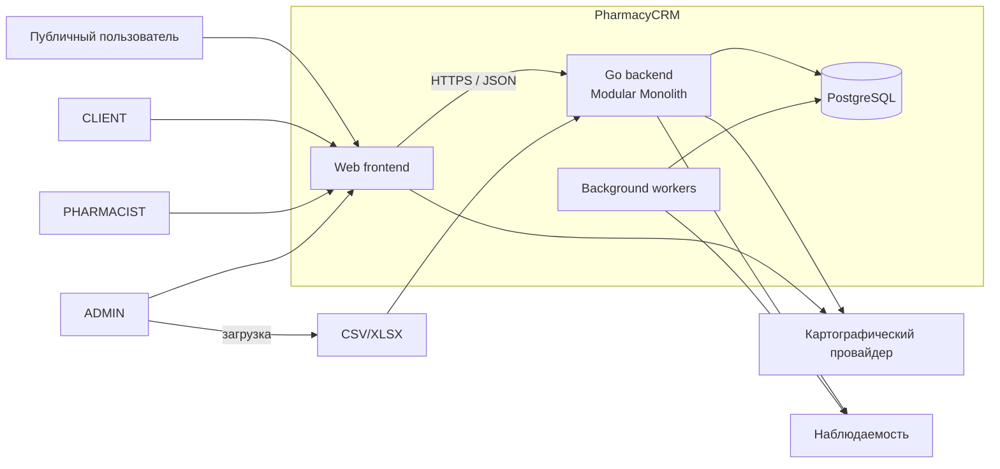
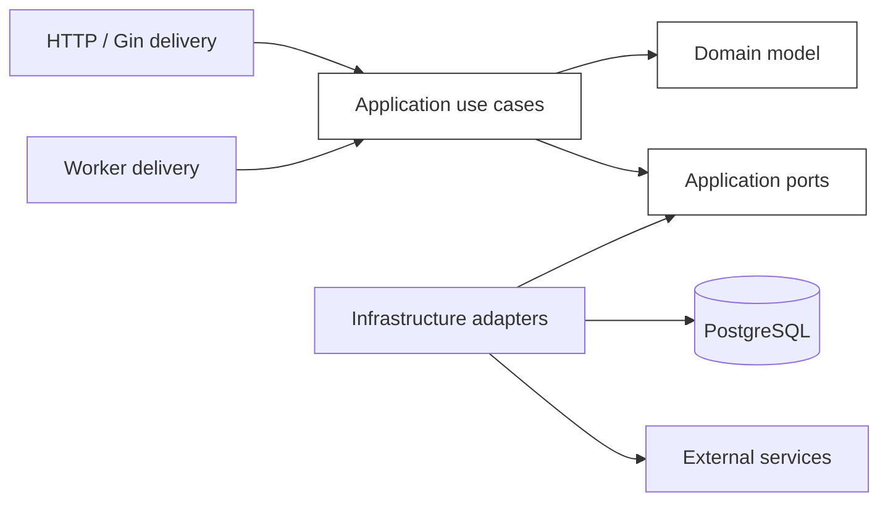

# PharmacyCRM — Architecture

**Статус документа:** Draft  
**Версия:** 2.0  
**Дата:** 2026-07-21  

## 1. Назначение документа

Документ определяет целевую архитектуру PharmacyCRM: архитектурный стиль, границы backend-модулей, правила зависимостей, слои приложения, транзакционные границы, модель согласованности, подход к доставке HTTP-запросов, фоновым процессам и инфраструктурным адаптерам.

Документ является нормативным для реализации. Он не заменяет:

- `01-product-vision.md` — продуктовые цели и границы MVP;
- `02-srs.md` — обязательное внешнее поведение системы;
- `03-system-context.md` — системную границу и внешние взаимодействия;
- ADR — детальные решения по отдельным архитектурно значимым вопросам;
- будущие документы по API, данным, безопасности, развёртыванию, тестированию и наблюдаемости.

При противоречии применяется порядок приоритетов, установленный в SRS. Этот документ не должен незаметно изменять продуктовые требования.

## 2. Архитектурные цели

Архитектура PharmacyCRM должна обеспечивать:

1. корректность складских и торговых операций;
2. явные и проверяемые транзакционные границы;
3. невозможность обхода бизнес-инвариантов через HTTP, фоновые задачи или прямую работу репозитория;
4. независимость бизнес-логики от Gin, `pgx`, PostgreSQL и формата HTTP;
5. локализацию изменений внутри бизнес-модуля;
6. контролируемое взаимодействие между модулями;
7. возможность тестировать use case без запуска HTTP-сервера и реальной БД;
8. трассируемость критических операций;
9. эволюцию модульного монолита без преждевременного перехода к микросервисам;
10. безопасное добавление новых внешних интеграций через адаптеры.

## 3. Архитектурный стиль

### 3.1 Модульный монолит

PharmacyCRM реализуется как модульный монолит: единое развёртываемое backend-приложение с одной основной PostgreSQL-базой данных, но с явно разделёнными бизнес-модулями и запрещёнными произвольными зависимостями между ними.

Модульный монолит выбран потому, что для MVP важнее:

- атомарность операций между складом, продажами и аудитом;
- простота эксплуатации;
- единая модель данных;
- отсутствие распределённых транзакций;
- быстрая разработка небольшой командой;
- возможность выделить сервис только после появления измеримой причины.

Разделение на модули является архитектурным, а не только каталоговым. Один модуль не должен напрямую использовать внутренние структуры, таблицы, репозитории или delivery-объекты другого модуля.

### 3.2 Clean Architecture

Внутри backend применяется Clean Architecture — организация зависимостей, при которой бизнес-правила не зависят от фреймворков, базы данных и транспорта.

Направление зависимостей:

```text
Delivery / Infrastructure -> Application -> Domain
```

Допустимые зависимости направлены внутрь. Domain не знает о слоях Application, Infrastructure и Delivery. Application знает о Domain и объявленных портах. Infrastructure и Delivery реализуют или вызывают эти порты.

### 3.3 Domain-oriented modules

Код группируется прежде всего по бизнес-возможностям, а не глобально по техническим типам. Не допускается единый общепроектный каталог `handlers`, `services` или `repositories`, в который складываются реализации всех областей.

Каждый модуль владеет:

- своей доменной моделью;
- прикладными сценариями;
- интерфейсами необходимых портов;
- инфраструктурными реализациями своих репозиториев;
- delivery-адаптерами своих endpoint;
- тестами;
- правилами доступа к своим данным.

## 4. Логические модули backend

Нормативная декомпозиция backend:

| Модуль | Ответственность |
|---|---|
| `identity` | пользователи, credentials, роли и sessions |
| `pharmacy` | аптеки, публичные данные и история `pharmacy_assignments` |
| `catalog` | глобальный каталог, presentations, barcodes, requests, import staging и moderation |
| `assortment` | ассортимент аптеки, локальные цены и правила отпуска |
| `inventory` | receipts, initial stock, lots, movements, write-offs и adjustments |
| `sales` | продажи, snapshots, totals и FEFO allocations |
| `returns` | возвраты по исходным sale allocations и refund state |
| `reliability` | idempotency, transactional outbox, retry и lease protocol |
| `audit` | неизменяемые audit events |
| `alerts` | low-stock, expiry и reconciliation alerts |
| `search` | rebuildable public availability projections |
| `replenishment` | вычисляемые рекомендации ручного пополнения |

Отдельные modules `import`, `receipt` и `adjustments` не создаются: соответствующие use cases принадлежат `catalog` или `inventory`.

## 5. Владение данными и межмодульные границы

### 5.1 Единоличное владение

Каждая бизнес-таблица имеет один модуль-владелец. Только владелец определяет:

- смысл полей;
- допустимые состояния;
- правила изменения;
- интерфейсы чтения и записи;
- миграции, изменяющие семантику таблицы.

Другой модуль не должен изменять чужие таблицы напрямую даже при наличии технического доступа к той же БД.

### 5.2 Допустимые способы взаимодействия

Межмодульное взаимодействие выполняется одним из способов:

1. вызов публичного application-порта модуля;
2. использование узкого query-порта для чтения необходимых данных;
3. координация нескольких модулей прикладным use case через Unit of Work;
4. публикация внутреннего доменного события после успешного commit, когда немедленная согласованность не требуется;
5. чтение специально созданной проекции.

Запрещается:

- импортировать внутренний repository package другого модуля;
- использовать его ORM/SQL-модели как общий контракт;
- передавать `pgx.Tx`, `pgxpool.Pool`, `gin.Context` или SQL-строку через application/domain API;
- обновлять чужие таблицы в обход публичного контракта;
- формировать циклические зависимости между модулями.

### 5.3 Ссылки между модулями

Внешняя ссылка на сущность другого модуля представляется идентификатором и, при необходимости, историческим снимком. Модуль не получает право управлять внешней сущностью только потому, что хранит её идентификатор.

Пример: строка продажи хранит `product_presentation_id`, но исторические название, дозировка, упаковочный коэффициент и цена фиксируются снимком. Изменение каталога не должно переписывать проведённую продажу.

## 6. Слои модуля

### 6.1 Domain

Domain содержит бизнес-понятия и правила, не зависящие от инфраструктуры.

В Domain размещаются:

- сущности и агрегаты;
- value objects (объекты-значения, определяемые содержимым, а не идентификатором);
- бизнес-инварианты;
- допустимые переходы состояний;
- доменные ошибки;
- чистые расчёты;
- доменные события, если они нужны.

Domain не должен импортировать:

- Gin;
- `net/http`;
- `pgx`;
- драйвер БД;
- логгер;
- конфигурацию окружения;
- JSON DTO;
- системное время напрямую, если время влияет на проверяемое бизнес-правило.

Зависимости вроде часов, генератора идентификаторов или криптографического сервиса передаются через порты либо как уже полученные значения.

### 6.2 Application

Application реализует use case — законченные пользовательские или системные сценарии.

Application отвечает за:

- координацию доменных объектов;
- авторизационные проверки уровня сценария;
- открытие транзакционной границы через Unit of Work;
- вызов репозиториев через интерфейсы;
- идемпотентность команд;
- порядок блокировок;
- формирование результата сценария;
- планирование post-commit действий.

Application не должен:

- принимать или возвращать `gin.Context`;
- зависеть от HTTP status code;
- выполнять SQL;
- управлять `pgx.Tx` напрямую;
- доверять итоговым суммам, остаткам или правам, переданным клиентом;
- создавать скрытые транзакции внутри отдельных репозиториев для многомодульного сценария.

### 6.3 Infrastructure

Infrastructure содержит технические адаптеры:

- PostgreSQL-репозитории на `pgx`;
- реализацию Unit of Work;
- хэширование паролей;
- генерацию и проверку токенов;
- файловый импорт;
- картографический клиент;
- технический логгер;
- метрики и tracing;
- реализацию часов и генераторов идентификаторов.

Инфраструктурная реализация обязана сохранять семантику портов Application и Domain. Ошибки драйвера не должны бесконтрольно протекать наружу: они переводятся в стабильные прикладные категории ошибок с сохранением причины для логирования.

### 6.4 Delivery

Delivery адаптирует внешнее взаимодействие к application-use-case.

Для HTTP delivery отвечает за:

- маршрутизацию;
- ограничение размера тела;
- декодирование и структурную валидацию входа;
- извлечение аутентификационного контекста;
- вызов use case;
- перевод прикладной ошибки в HTTP-ответ;
- сериализацию ответа;
- correlation/request ID;
- безопасное логирование результата запроса.

Delivery не реализует бизнес-правила и не выполняет SQL.

## 7. HTTP-архитектура

### 7.1 Gin как delivery framework

Gin используется только как HTTP-delivery framework. `gin.Context` не покидает delivery-слой.

Handler должен иметь форму адаптера:

```text
HTTP request
  -> decode and validate shape
  -> build application command/query
  -> call use case with context.Context
  -> map result or error
  -> HTTP response
```

### 7.2 Запуск HTTP-сервера

Приложение запускает Gin через `gin.New()`, явно подключая требуемые middleware. Использование неявного набора middleware через `gin.Default()` не является базовым вариантом.

Gin router передаётся в явно сконфигурированный `http.Server`. Должны быть заданы как минимум:

- `ReadHeaderTimeout`;
- `ReadTimeout`;
- `WriteTimeout`;
- `IdleTimeout`;
- ограничение максимального размера заголовков;
- процедура graceful shutdown.

Конкретные значения определяются deployment-документом и конфигурацией окружения.

### 7.3 Middleware

Middleware применяется только для поперечных технических задач:

- recovery;
- request ID;
- access logging;
- CORS;
- authentication parsing;
- rate limiting;
- security headers;
- метрики и tracing.

Middleware может установить идентификатор пользователя и сведения о токене, но окончательная авторизация бизнес-операции выполняется use case с повторной проверкой актуального состояния пользователя и назначения аптеке, когда это требует SRS.

## 8. Транзакционная модель

### 8.1 Транзакционная граница принадлежит use case

Транзакция соответствует завершённой бизнес-команде, а не отдельному вызову репозитория.

Примеры одной транзакции:

- проведение поступления и создание лотов;
- проведение продажи, распределение количества по FEFO, уменьшение остатков, создание движений и аудита;
- возврат, распределение возвращаемого количества, изменение допустимых остатков и создание компенсирующих движений;
- списание или корректировка с изменением остатков и аудитом;
- публикация записи staging в глобальный каталог.

Handler, domain entity и отдельный repository method не управляют commit или rollback.

### 8.2 Unit of Work

Application использует абстракцию Unit of Work, не зависящую от `pgx`.

Концептуальный контракт:

```go
type UnitOfWork interface {
    WithinTransaction(ctx context.Context, fn func(ctx context.Context, tx TxScope) error) error
}
```

`TxScope` предоставляет application только необходимые транзакционные порты или фабрики репозиториев. Он не раскрывает `pgx.Tx`.

Точная форма интерфейса определяется ADR и реализацией, но обязательны следующие свойства:

- commit выполняется только после успешного завершения callback;
- при ошибке выполняется rollback;
- panic не должен оставлять открытую транзакцию;
- ошибка callback сохраняет приоритет над вторичной ошибкой rollback;
- ошибка commit возвращается вызывающему коду;
- application-код не выполняет ручной commit/rollback;
- вложенные независимые транзакции в одном use case запрещены без отдельного ADR.

### 8.3 Репозитории в транзакции

Один и тот же application-порт должен быть доступен как в обычном read-only контексте, так и внутри транзакционного scope, если это действительно требуется.

Репозиторий не должен самопроизвольно начинать новую транзакцию, если вызывающий use case уже определил общую транзакционную границу.

### 8.4 Изоляция и блокировки

Базовый уровень изоляции PostgreSQL выбирается осознанно для каждого класса операций. Повышение уровня изоляции не заменяет правильные ограничения и блокировки.

Для конкурентных изменений остатков применяются:

- ограничения БД, запрещающие отрицательный остаток;
- `SELECT ... FOR UPDATE` или эквивалентная блокировка изменяемых строк;
- детерминированный порядок захвата блокировок;
- повторная проверка состояния после получения блокировки;
- атомарное изменение остатка и создание движения.

При блокировке нескольких лотов порядок должен быть стабильным, например:

1. срок годности по возрастанию;
2. дата поступления или создания по возрастанию;
3. идентификатор лота по возрастанию.

Одинаковый порядок снижает вероятность deadlock и одновременно соответствует FEFO.

### 8.5 Ограничения БД как последняя линия защиты

Критические инварианты дублируются ограничениями PostgreSQL там, где это возможно:

- `NOT NULL`;
- `CHECK`;
- `UNIQUE`;
- внешние ключи;
- частичные уникальные индексы;
- запрет отрицательных количеств;
- допустимые статусы;
- кардинальность связей;
- уникальность idempotency key в необходимом scope.

Application должен давать понятную доменную ошибку, но корректность данных не должна зависеть только от application-кода.

## 9. Идемпотентность и канонический transaction protocol

Полная identity критической команды:

```text
actor + operation + effective_scope + idempotency_key
```

Для pharmacy command `effective_scope = pharmacy_id`; для global/admin command — `GLOBAL`. Semantic fingerprint включает path/resource IDs, effective scope, применимую resource version и смысловой payload; `request_id`, порядок JSON keys и transport-only metadata исключаются.

Authenticated critical mutation выполняется только в следующем порядке:

1. delivery проверяет credential format, DTO, headers и transport limits;
2. до транзакции выполняются только детерминированные validation/canonicalization;
3. Unit of Work начинает PostgreSQL transaction;
4. первым сериализующим lock берётся idempotency record;
5. внутри transaction повторно читаются current user, session, role, pharmacy assignment и pharmacy state;
6. replay возвращается только после текущей authorization и result-visibility revalidation;
7. business roots блокируются в каноническом порядке;
8. после locks повторно вычисляются eligibility, prices, quantities, FEFO и return limits;
9. атомарно сохраняются business document, snapshots, allocations, lot balances и append-only movements;
10. сохраняются mandatory transactional audit и необходимые `outbox_events`;
11. idempotency record переводится в `COMPLETED` с replayable result/reference;
12. commit предшествует successful HTTP response.

Канонический lock order:

1. idempotency scope/key;
2. current actor/user/session/role для security-sensitive mutation;
3. target user, если он изменяется;
4. pharmacy;
5. root business document (`sale`, `receipt`, `sale_return`, adjustment/reversal root);
6. `pharmacy_products` по `id`;
7. sale items/source allocations по `id`;
8. stock lots по `expiration_date`, затем `received_at`, затем `id`;
9. inserts documents, allocations, movements, audit, outbox и completed idempotency result;
10. commit.

Use case пропускает ненужный уровень, но не меняет взаимный порядок остальных locks. Retryable PostgreSQL error повторяет всю transaction function с idempotency claim; внешний network side effect внутри callback запрещён.

## 10. Модель складских изменений

### 10.1 Остаток и движения

Текущий остаток лота хранится как операционное значение для эффективных проверок и блокировок. Каждое его изменение сопровождается неизменяемым `InventoryMovement`.

Движения являются append-only: существующая проводка не редактируется и не удаляется для исправления истории. Ошибка исправляется отдельной компенсирующей операцией.

### 10.2 Базовая единица отпуска

Все количества внутри inventory и sales хранятся в целых базовых единицах отпуска. Пересчёт упаковок, блистеров, ампул и иных уровней выполняется по зафиксированному коэффициенту.

Дробные складские остатки запрещены, если соответствующая дробность не определена как отдельная целая базовая единица.

### 10.3 FEFO

FEFO является бизнес-правилом, а не UI-сортировкой. Распределение продажи по лотам выполняет backend внутри транзакции после блокировки подходящих лотов.

Не участвуют в распределении:

- просроченные лоты;
- карантинные лоты;
- архивные или закрытые лоты;
- лоты без доступного остатка;
- лоты, не разрешённые к продаже по иным бизнес-правилам.

### 10.4 Проведённые документы

Поступления, продажи, возвраты, списания и корректировки могут иметь состояние черновика только до проведения, если такой сценарий разрешён SRS.

После проведения:

- бизнес-эффект применён атомарно;
- документ не редактируется как черновик;
- документ не удаляется физически;
- исправление выполняется сторнированием или отдельной компенсирующей операцией;
- значимые значения сохраняются историческими снимками.

## 11. Продажи и возвраты

### 11.1 Продажа

Use case проведения продажи обязан в одной транзакции:

1. повторно проверить пользователя и его назначение аптеке;
2. проверить или создать запись идемпотентности;
3. загрузить актуальные ассортиментные правила;
4. вычислить итоговые количества и цену на backend;
5. выбрать и заблокировать подходящие лоты в детерминированном FEFO-порядке;
6. проверить достаточность суммарного остатка;
7. создать документ и строки продажи со снимками;
8. уменьшить остатки лотов;
9. создать движения;
10. создать аудит;
11. сохранить повторяемый результат команды;
12. выполнить commit.

### 11.2 Возврат

Возврат является отдельным документом, связанным с исходной продажей. Он не переписывает количество или сумму исходной продажи.

Система должна отделять:

- факт принятия возврата от клиента;
- финансовый эффект;
- решение о возвращении товара в доступный остаток.

Возврат в продаваемый остаток допускается только при выполнении нормативных и бизнес-условий. Если возврат не может быть повторно продан, он учитывается отдельным движением и направляется в карантин, списание или иной утверждённый процесс.

Распределение возвращаемого количества по исходным sale allocations должно быть детерминированным и не допускать возврата количества сверх ранее проданного с учётом уже проведённых возвратов.

## 12. Аутентификация и авторизация

### 12.1 Аутентификация

Механизм сессий и токенов определяется security design. Независимо от формата токена:

- пароль хранится только как стойкий hash;
- токен не содержит доверенного права изменить произвольную аптеку;
- заблокированный или архивный пользователь должен терять доступ в пределах установленной политики сессий;
- секреты и токены не логируются.

### 12.2 Авторизация

Авторизация выполняется на нескольких уровнях:

1. delivery проверяет наличие и базовую валидность учётных данных;
2. application проверяет роль и право выполнить конкретный use case;
3. критический use case повторно читает актуальное состояние пользователя и назначение аптеке;
4. repository ограничивает запрос конкретным tenant scope, где это применимо;
5. БД обеспечивает ссылочную и структурную целостность.

`pharmacy_id` из URL или JSON считается недоверенным вводом. Право пользователя работать с этой аптекой проверяет backend.

## 13. Ошибки

Domain и Application используют стабильные категории ошибок, например:

- validation;
- unauthenticated;
- forbidden;
- not found;
- conflict;
- invariant violation;
- insufficient stock;
- idempotency conflict;
- dependency unavailable;
- internal.

Delivery переводит их в HTTP-коды и единый error envelope. Domain не знает о `400`, `404`, `409` или `500`.

Infrastructure сохраняет техническую причину через wrapping, но не раскрывает пользователю SQL, названия таблиц, stack trace или чувствительные данные.

## 14. Чтение, проекции и согласованность

### 14.1 Операционные чтения

Операционные экраны аптекаря читают актуальные данные из PostgreSQL либо из проекции с явно определённой гарантией свежести.

Для принятия решения о продаже, возврате, списании или корректировке use case всегда повторно проверяет данные внутри транзакции. Данные, ранее показанные UI, могут устареть.

### 14.2 Публичный поиск

Публичный поиск может использовать отдельную read model — денормализованную проекцию, оптимизированную для поиска по препарату, цене, географии и доступности.

Для MVP допускается построение проекции в PostgreSQL. Добавление Redis, поискового движка или отдельного сервиса требует измеримой необходимости и ADR.

Публичная проекция не является источником истины для проведения продажи. Её допустимая задержка и отображение времени актуальности определяются SRS и API design.

### 14.3 Синхронная и eventual consistency

Сильная согласованность обязательна внутри критического складского или торгового use case.

Eventual consistency (согласованность с допустимой задержкой) разрешается для:

- публичной поисковой проекции;
- предупреждений;
- рекомендаций;
- агрегированной аналитики;
- внешней наблюдаемости.

Граница между ними должна быть явной. Нельзя переводить изменение остатка или создание движения в eventual consistency без нового ADR и изменения требований.

## 15. Committed events и transactional outbox

Domain event именуется в прошедшем времени и отражает уже committed business fact. Канонический event catalog:

| Context | Events |
|---|---|
| Identity | `UserCreated`, `UserBlocked`, `UserUnblocked`, `UserArchived`, `UserPasswordChanged`, `UserRoleAssigned`, `UserRoleRevoked`, `SessionCreated`, `SessionRotated`, `SessionRevoked` |
| Pharmacy | `PharmacistAssigned`, `PharmacistAssignmentEnded` |
| Catalog | `ProductCreated`, `ProductArchived`, `PresentationCreated`, `BarcodeAssigned`, `CatalogImportCompleted` |
| Assortment | `PharmacyProductActivated`, `PharmacyProductPriceChanged` |
| Inventory | `ReceiptPosted`, `InitialStockConfirmed`, `WriteOffCompleted`, `InventoryAdjusted`, `InventoryOperationReversed` |
| Sales | `SaleCompleted`, `SalePartiallyRefunded`, `SaleRefunded`, `SaleReversed` |
| Returns | `SaleReturnCompleted`, `SaleReturnReversed` |

Technical names используют lower-case dot namespace, например `pharmacy.assignment.ended`, `inventory.receipt.posted`, `sales.sale.completed`, `returns.sale_return.completed`, но не описывают иной факт.

Любая durable post-commit reaction, потеря которой нарушит correctness, freshness проекции, alert/import/security workflow или внешний side effect, создаёт `outbox_events` row в той же transaction, что business effect, audit и completed idempotency result. Delivery — at-least-once; consumer обязан быть idempotent; worker использует lease, guarded completion/fencing, bounded retry и dead-letter. In-process goroutine/channel или прямой publish внутри transaction не являются альтернативой outbox.

## 16. Фоновые процессы

Фоновые задачи используют те же application-use-case и порты, что и HTTP delivery. Worker не должен напрямую обновлять таблицы в обход бизнес-логики.

Типовые задачи:

- поиск приближающихся сроков годности;
- формирование предупреждений;
- пересчёт рекомендаций по пополнению;
- обработка staging-импорта;
- обновление поисковой проекции;
- обработка outbox;
- техническая очистка истёкших сессий и временных данных.

Для фоновых задач обязательны:

- ограниченный batch size;
- идемпотентность;
- lease, advisory lock или иной механизм запрета нежелательного параллельного выполнения;
- retry с ограничением и backoff;
- dead-letter или операторский сигнал для необрабатываемой ошибки;
- метрики длительности, успеха и отказов;
- graceful shutdown.

## 17. Импорт данных

CSV/XLSX и иные импортируемые файлы считаются недоверенным вводом.

Архитектура импорта разделяется на этапы:

1. приём файла и техническая проверка;
2. безопасный parsing с ограничениями размера и количества строк;
3. запись в staging;
4. структурная и бизнес-валидация;
5. нормализация;
6. поиск возможных соответствий и дублей;
7. ручная модерация;
8. явная публикация через application-use-case.

Импорт не должен напрямую создавать опубликованные карточки, проведённые документы или остатки без соответствующего сценария проверки и проведения.

Результат импорта должен содержать воспроизводимый отчёт об ошибках по строкам без утечки внутренней структуры БД.

## 18. Композиция приложения

Composition Root — единственное место сборки графа зависимостей приложения.

Он отвечает за:

- загрузку и валидацию конфигурации;
- создание `pgxpool.Pool`;
- создание Unit of Work;
- создание инфраструктурных адаптеров;
- создание application-use-case;
- регистрацию HTTP handlers и middleware;
- создание workers;
- настройку логирования, метрик и tracing;
- запуск HTTP-сервера и фоновых процессов;
- graceful shutdown.

Composition Root находится во внешнем слое, обычно в `cmd/<app>` и/или `internal/app`. Domain и Application не используют service locator и не читают глобальный контейнер зависимостей.

Глобальные изменяемые singleton-объекты запрещены, кроме технически обоснованных потокобезопасных объектов, созданных в composition root и переданных явно.

## 19. Конфигурация и секреты

Конфигурация загружается при старте, валидируется и после запуска рассматривается как неизменяемая.

Обязательные правила:

- секреты не хранятся в репозитории;
- отсутствующая обязательная конфигурация вызывает fail-fast при запуске;
- значения имеют типизированное представление;
- значения production не подменяются небезопасными default;
- чувствительные значения маскируются в логах;
- runtime-код не читает переменные окружения из произвольных модулей.

## 20. Наблюдаемость

Архитектура должна поддерживать:

- структурированные логи;
- request/correlation ID;
- trace ID при наличии tracing;
- метрики HTTP и workers;
- метрики пула БД и транзакций;
- длительность и исход критических use case;
- число конфликтов идемпотентности;
- deadlock и serialization failures;
- ошибки импорта;
- задержку поисковой проекции;
- сигналы о невыполненных фоновых задачах.

Бизнес-аудит и технические логи имеют разное назначение. Успешная запись технического лога не заменяет обязательную запись бизнес-аудита.

Логи не должны содержать пароли, токены, полные персональные данные, содержимое секретов или чувствительный импортируемый файл.

## 21. Надёжность и graceful degradation

PostgreSQL является критической зависимостью для проведения операций. При его недоступности изменения не принимаются как успешно проведённые.

Некритические зависимости должны деградировать изолированно:

- недоступность картографического провайдера не блокирует складские операции;
- сбой публичной проекции не меняет источник истины;
- сбой предупреждений не повреждает остатки;
- сбой внешней наблюдаемости не должен приводить к успешному ответу при фактически неуспешной бизнес-операции;
- неопределённый сетевой результат критической команды разрешается повтором с тем же idempotency key.

Все внешние вызовы получают timeout. Бесконечные ожидания запрещены.

## 22. Безопасность архитектурных границ

Обязательные принципы:

- deny by default;
- least privilege;
- недоверие ко всем данным клиента;
- повторная авторизация критических команд;
- параметризованный SQL;
- ограничения размера входа;
- безопасная обработка файлов;
- отсутствие динамической интерпретации пользовательского содержимого;
- защита от массового назначения полей;
- отдельные DTO для входа, домена и persistence;
- минимизация выдаваемых данных;
- неизменяемый аудит критических действий;
- контролируемая работа администратора без права переписывать историю.

Детальная модель угроз и механизмы защиты фиксируются в security design.

## 23. Тестируемость

Архитектура должна позволять следующие уровни тестов:

1. unit-тесты Domain без БД и HTTP;
2. unit-тесты Application с fake/mock-портами;
3. repository integration tests с реальным PostgreSQL;
4. transaction/concurrency tests для блокировок и идемпотентности;
5. HTTP contract tests;
6. module integration tests;
7. end-to-end тесты критических сценариев;
8. migration tests;
9. worker tests;
10. security и authorization tests.

Мокирование внутренних деталей не должно подменять проверку реальных SQL-ограничений и конкурентного поведения PostgreSQL.

## 24. Запрещённые архитектурные практики

В PharmacyCRM запрещается без отдельного принятого ADR:

- один общий `handler.go`, `service.go` или `repository.go` для несвязанных модулей;
- бизнес-логика в Gin handlers;
- `gin.Context` вне delivery;
- `pgx.Tx` или `pgxpool.Pool` в Domain/Application API;
- транзакция на каждый repository method вместо бизнес-use-case;
- прямое обновление остатков без движения;
- удаление или изменение проведённых движений;
- доверие цене, сумме, остатку или роли из frontend;
- общий пакет `models`, содержащий одновременно HTTP DTO, domain entities и DB rows;
- межмодульный импорт внутренних repository implementation;
- циклические зависимости;
- скрытый service locator;
- глобальная изменяемая конфигурация;
- выполнение внешнего необратимого действия до commit локальной транзакции;
- добавление Redis, брокера, поискового движка или микросервиса без измеримой необходимости;
- обработка ошибок через сравнение текстовых сообщений;
- фоновые workers, напрямую выполняющие произвольный SQL в обход use case.

## 25. Целевая схема контейнеров



Frontend и backend являются отдельными runtime-компонентами, но бизнес-источником истины является backend с PostgreSQL. Worker может быть отдельным процессом того же кодового продукта либо частью одного бинарника; решение развёртывания фиксируется в deployment-документе.

## 26. Внутренняя схема backend



Стрелки показывают направление вызова. Направление compile-time зависимости для реализаций портов инвертировано: интерфейс объявляется во внутреннем слое, инфраструктура его реализует.

## 27. Связь с ADR

Архитектура детализируется принятыми ADR, включая решения по:

- хранению количества в базовых единицах отпуска;
- неизменяемым складским движениям;
- детерминированным пессимистическим блокировкам;
- бизнес-транзакциям продажи;
- возвратам и допустимости восстановления остатка;
- явным границам Unit of Work;
- Gin как HTTP-delivery framework;
- границам backend-модулей и composition root.

При изменении одного из этих решений сначала создаётся новый ADR, который заменяет или уточняет предыдущий. После принятия ADR этот документ синхронизируется.

## 28. Remaining implementation decisions

Gate E0 закрыт. До production остаётся выбрать конкретные продукты и численные параметры, не меняющие утверждённые contracts:

1. допустимую задержку public availability projection;
2. способ запуска worker process в deployment topology;
3. search/projection rebuild implementation;
4. exact SLI/SLO и capacity limits;
5. secret manager, observability stack и operator runbooks;
6. elevated approval model для adjustment/reversal.

Эти вопросы не открывают повторно module ownership, transaction order, lock order, outbox, retry, auth/session transport, retention, RPO/RTO, return baseline или frontend tooling.

## 29. Критерии соответствия реализации

Реализация соответствует архитектуре, если:

- каждый endpoint вызывает application-use-case, а не SQL;
- `gin.Context` ограничен delivery-слоем;
- Domain не импортирует инфраструктурные пакеты;
- Application не зависит от `pgx`;
- критическая бизнес-команда имеет одну явную транзакционную границу;
- остаток и движение изменяются атомарно;
- блокировки берутся в детерминированном порядке;
- межмодульная запись выполняется через публичный контракт и Unit of Work;
- проведённые документы и движения не переписываются;
- authorization scope повторно проверяется backend;
- критические команды идемпотентны;
- фоновые процессы используют application-use-case;
- внешние зависимости имеют timeout и изолированную деградацию;
- dependency graph не содержит запрещённых циклов;
- composition root является единственным местом сборки приложения;
- архитектурно значимые отклонения имеют ADR.

## 30. Итог

Целевая архитектура PharmacyCRM — модульный монолит на Go с Clean Architecture, доменно ориентированными модулями, PostgreSQL как транзакционным источником истины, явным Unit of Work и тонкими delivery-адаптерами.

Главный критерий архитектуры — не количество слоёв и интерфейсов, а сохранение бизнес-инвариантов при конкурентной работе, сбоях, повторных запросах и дальнейшем развитии системы.
