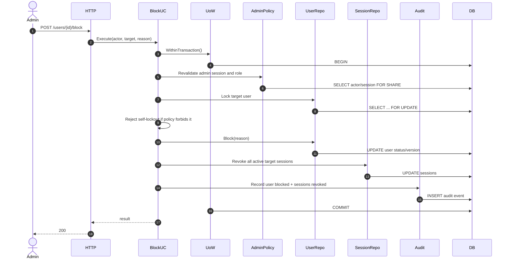
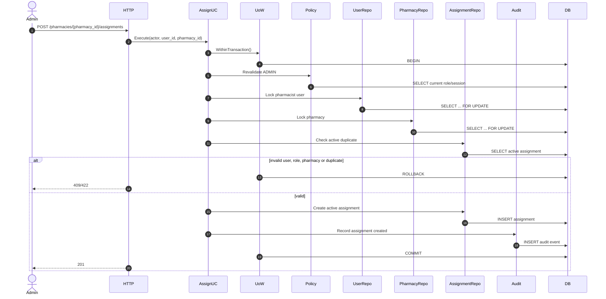
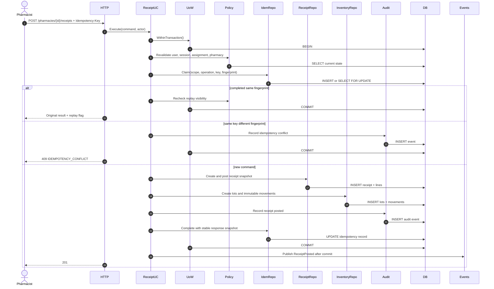
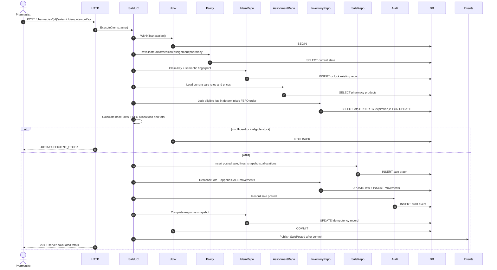
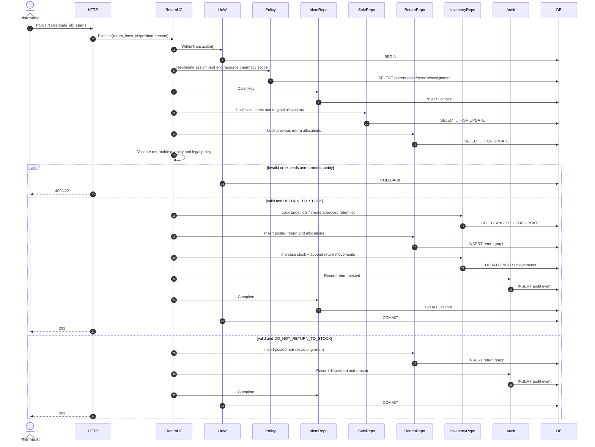
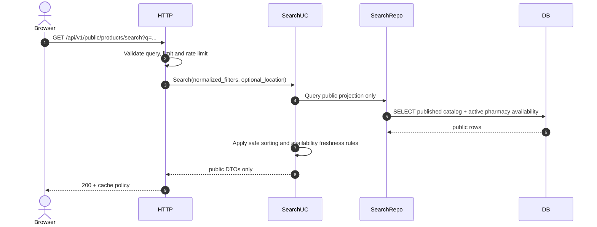
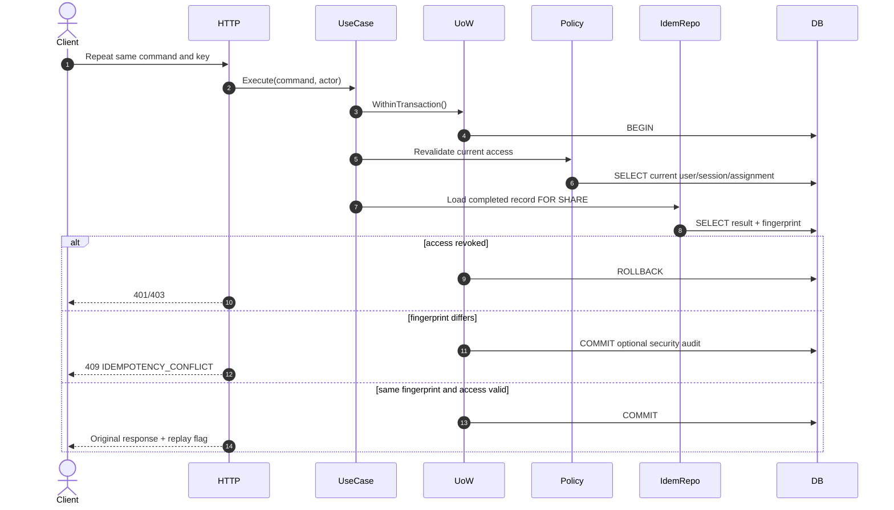
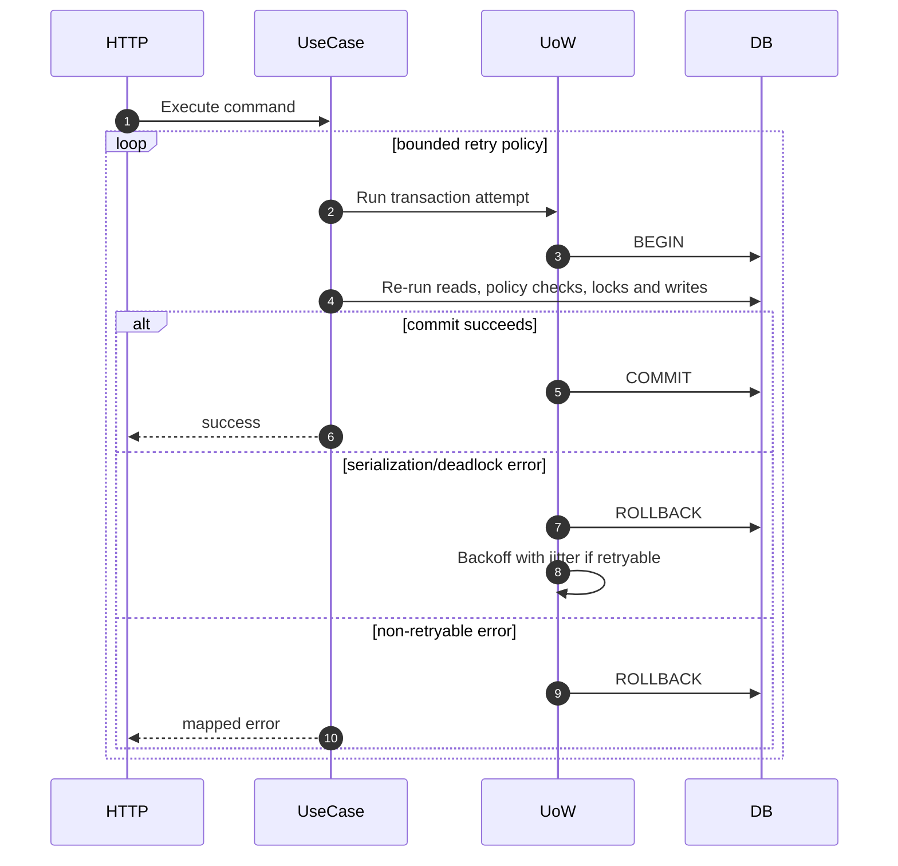
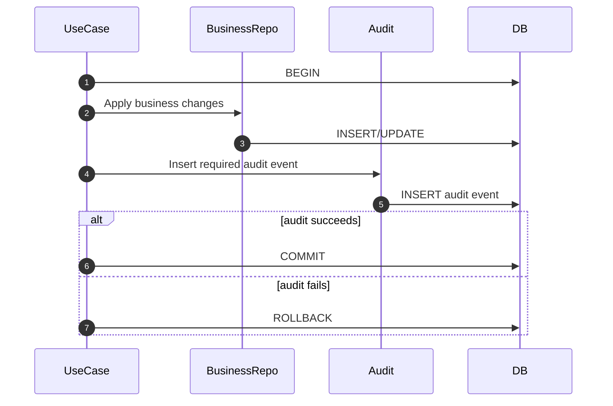
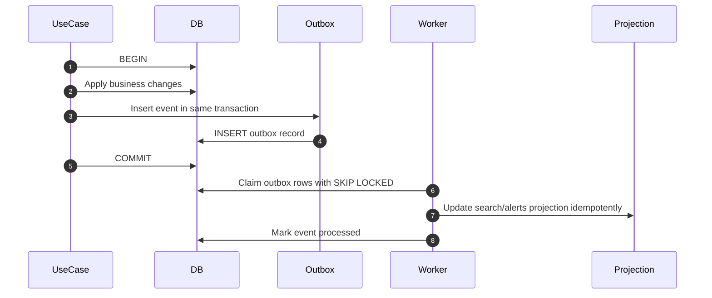

# PharmacyCRM — Sequence Diagrams

**Статус документа:** Draft  
**Версия:** 0.1  
**Дата:** 2026-07-20  
**Связанные документы:** `02-srs.md`, `03-system-context.md`, `04-architecture.md`, `04-01-backend-architecture.md`, `05-api-design.md`, `06-database-design.md`, `07-domain-model.md`, `09-security-design.md`

## 1. Назначение и нормативная роль

Документ фиксирует последовательности критических сценариев PharmacyCRM: участников, порядок вызовов, границы транзакций, блокировки, повторные проверки полномочий, идемпотентность, audit, commit/rollback и post-commit действия.

Диаграммы не заменяют API-контракты, Domain Model или Database Design. Они связывают эти документы в исполнимые сценарии и показывают, где именно должны соблюдаться инварианты.

Если реализация меняет порядок security-sensitive проверок, transaction boundary, lock order, idempotency protocol, audit semantics или момент публикации post-commit события, соответствующая диаграмма обновляется в том же change set.

## 2. Нотация и правила чтения

Диаграммы записаны в Mermaid `sequenceDiagram`.

Участники:

- `Browser` — недоверенный клиент;
- `HTTP` — Gin delivery, middleware и единый responder;
- `UseCase` — application service;
- `Policy` — authorization policy;
- `UoW` — Unit of Work;
- `Repo` — repository ports и PostgreSQL adapters;
- `DB` — PostgreSQL;
- `Audit` — transactional audit writer;
- `Outbox/Events` — post-commit публикация внутренних событий;
- `Worker` — фоновый процесс.

Нормативные правила:

1. `HTTP` не выполняет бизнес-логику и SQL.
2. `UseCase` координирует authorization, idempotency, UoW, lock order и domain operations.
3. Все stale-sensitive полномочия повторно проверяются в транзакции до изменения бизнес-данных.
4. Audit, необходимый для признания операции успешной, записывается до commit в той же транзакции.
5. Post-commit действия не выполняются до успешного commit.
6. Повтор транзакции после serialization failure или deadlock не должен создавать повторный эффект.
7. Ошибка на любом обязательном шаге приводит к rollback.

## 3. Вход пользователя и создание сессии

```mermaid
sequenceDiagram
    autonumber
    actor Browser
    participant HTTP
    participant LoginUC as LoginUseCase
    participant UoW
    participant UserRepo
    participant SessionRepo
    participant Audit
    participant DB

    Browser->>HTTP: POST /api/v1/auth/login
    HTTP->>HTTP: Validate JSON, request size, rate limit
    HTTP->>LoginUC: Execute(normalized_login, password, request_context)
    LoginUC->>UoW: WithinTransaction()
    UoW->>DB: BEGIN
    LoginUC->>UserRepo: GetByNormalizedLoginForAuth()
    UserRepo->>DB: SELECT user + password hash
    DB-->>UserRepo: user state
    LoginUC->>LoginUC: Verify password hash in constant-time-compatible flow
    alt user missing or password invalid
        LoginUC->>Audit: Record login denied without user enumeration
        Audit->>DB: INSERT security event
        UoW->>DB: COMMIT
        LoginUC-->>HTTP: ErrInvalidCredentials
        HTTP-->>Browser: 401 UNAUTHENTICATED
    else user inactive
        LoginUC->>Audit: Record login denied: blocked/archived
        Audit->>DB: INSERT security event
        UoW->>DB: COMMIT
        LoginUC-->>HTTP: ErrInvalidCredentials
        HTTP-->>Browser: 401 UNAUTHENTICATED
    else valid active user
        LoginUC->>SessionRepo: Create session + refresh token hash
        SessionRepo->>DB: INSERT session
        LoginUC->>Audit: Record login success
        Audit->>DB: INSERT audit event
        UoW->>DB: COMMIT
        LoginUC-->>HTTP: access token + raw refresh token
        HTTP-->>Browser: 200 + access token; HttpOnly refresh cookie
    end
```

Инварианты:

- неизвестный пользователь и неверный пароль имеют одинаковый внешний ответ;
- raw refresh token не сохраняется;
- blocked/archived user не получает session;
- login success не возвращается, если session или audit не сохранены.

## 4. Refresh token rotation и reuse detection

```mermaid
sequenceDiagram
    autonumber
    actor Browser
    participant HTTP
    participant RefreshUC
    participant UoW
    participant SessionRepo
    participant UserRepo
    participant Audit
    participant DB

    Browser->>HTTP: POST /api/v1/auth/refresh + cookie
    HTTP->>RefreshUC: Execute(raw_refresh_token, request_context)
    RefreshUC->>UoW: WithinTransaction()
    UoW->>DB: BEGIN
    RefreshUC->>SessionRepo: LockSessionByTokenSelector()
    SessionRepo->>DB: SELECT ... FOR UPDATE
    DB-->>SessionRepo: session family + generation
    RefreshUC->>RefreshUC: Verify token hash, expiry, generation
    RefreshUC->>UserRepo: GetCurrentUserState()
    UserRepo->>DB: SELECT status, role version
    alt token is current and user active
        RefreshUC->>SessionRepo: Mark generation used and insert next generation
        SessionRepo->>DB: UPDATE + INSERT
        RefreshUC->>Audit: Record refresh success
        Audit->>DB: INSERT audit event
        UoW->>DB: COMMIT
        RefreshUC-->>HTTP: new access + refresh token
        HTTP-->>Browser: 200; replace cookie
    else rotated token reused
        RefreshUC->>SessionRepo: Revoke entire token family
        SessionRepo->>DB: UPDATE sessions SET revoked_at
        RefreshUC->>Audit: Record refresh token reuse
        Audit->>DB: INSERT high-severity event
        UoW->>DB: COMMIT
        HTTP-->>Browser: 401; clear cookie
    else expired/revoked/inactive
        RefreshUC->>Audit: Record denied refresh
        Audit->>DB: INSERT event
        UoW->>DB: COMMIT
        HTTP-->>Browser: 401; clear cookie
    end
```

Два параллельных refresh request одного поколения не могут оба завершиться успешно.

## 5. Блокировка пользователя и отзыв сессий



Изменение статуса и отзыв сессий атомарны. После commit новый защищённый запрос пользователя должен быть отклонён в пределах Security SLA.

## 6. Назначение аптекаря аптеке



Отзыв назначения использует тот же lock order. Новые pharmacy-scoped mutations после commit запрещены; уже открытая mutation обязана повторно проверить assignment внутри своей транзакции.

## 7. Проведение поступления



Поступление, лоты, движения, idempotency result и transactional audit commit-ятся как единое целое.

## 8. Проведение продажи с FEFO



Frontend quantity, price, total и выбранный lot не являются источником истины. FEFO и итоговая сумма вычисляются backend после получения блокировок.

## 9. Конкурентная продажа одного остатка

```mermaid
sequenceDiagram
    autonumber
    participant SaleA
    participant SaleB
    participant DB

    par transaction A
        SaleA->>DB: BEGIN
        SaleA->>DB: SELECT lot FOR UPDATE
        DB-->>SaleA: lock acquired, quantity=10
    and transaction B
        SaleB->>DB: BEGIN
        SaleB->>DB: SELECT same lot FOR UPDATE
        DB-->>SaleB: waits
    end
    SaleA->>DB: UPDATE quantity=0; INSERT movement; COMMIT
    DB-->>SaleB: lock acquired, quantity=0
    SaleB->>SaleB: Recheck stock after lock
    SaleB->>DB: ROLLBACK
```

Проверка остатка до lock не является достаточной. Вторая транзакция обязана перечитать и перепроверить состояние после ожидания.

## 10. Возврат по исходной продаже



Возврат не изменяет исходную продажу и её аллокации. История расширяется новым проведённым документом и, при необходимости, компенсирующими движениями.

## 11. Списание или корректировка

```mermaid
sequenceDiagram
    autonumber
    actor Pharmacist
    participant HTTP
    participant AdjustmentUC
    participant UoW
    participant Policy
    participant InventoryRepo
    participant Audit
    participant DB

    Pharmacist->>HTTP: POST /inventory-adjustments + reason
    HTTP->>AdjustmentUC: Execute(command)
    AdjustmentUC->>UoW: WithinTransaction()
    UoW->>DB: BEGIN
    AdjustmentUC->>Policy: Revalidate actor and elevated permission if required
    Policy->>DB: SELECT current scope
    AdjustmentUC->>InventoryRepo: Lock affected lots in deterministic order
    InventoryRepo->>DB: SELECT ... FOR UPDATE
    AdjustmentUC->>AdjustmentUC: Validate reason, bounds and resulting quantity
    AdjustmentUC->>InventoryRepo: Insert posted document + immutable movements
    InventoryRepo->>DB: INSERT document/movements; UPDATE lot balances
    AdjustmentUC->>Audit: Record before/after delta and reason
    Audit->>DB: INSERT audit event
    UoW->>DB: COMMIT
    HTTP-->>Pharmacist: 201
```

Общий `PATCH stock_quantity` запрещён. Любая коррекция выражается отдельной предметной командой с reason и audit.

## 12. Импорт каталога через staging и модерацию

```mermaid
sequenceDiagram
    autonumber
    actor Admin
    participant HTTP
    participant ImportUC
    participant Storage
    participant DB
    participant Worker
    participant ModerationUC
    participant Audit

    Admin->>HTTP: Upload catalog file
    HTTP->>HTTP: Check type, size, filename, authorization
    HTTP->>Storage: Store quarantine object with generated name
    HTTP->>ImportUC: Create ImportJob(metadata, hash)
    ImportUC->>DB: BEGIN; INSERT job; INSERT audit; COMMIT
    HTTP-->>Admin: 202 + job_id
    Worker->>Storage: Read quarantined file as data only
    Worker->>Worker: Parse with row/column/size limits
    Worker->>DB: Write normalized staging rows and validation findings
    Worker->>DB: Mark job READY_FOR_REVIEW or FAILED
    Admin->>ModerationUC: Approve selected staging records
    ModerationUC->>DB: BEGIN
    ModerationUC->>DB: Revalidate ADMIN and lock staging rows
    ModerationUC->>DB: Create/update catalog through explicit domain commands
    ModerationUC->>Audit: Record moderation and publication
    Audit->>DB: INSERT audit event
    ModerationUC->>DB: COMMIT
```

Импорт не публикует данные напрямую. Ошибка одной строки не должна незаметно создавать частично опубликованный каталог.

## 13. Публичный поиск лекарства



Публичная проекция не содержит закупочных цен, точных внутренних остатков, lot IDs, audit или внутренних документов.

## 14. Идемпотентный replay после успешного commit



Существование успешного idempotency record не даёт права получить результат после блокировки пользователя или отзыва назначения.

## 15. Serialization failure, deadlock и безопасный retry



Retry повторяет всю транзакционную функцию, а не отдельный SQL statement. Внешние side effects выполняются только после окончательного commit. Idempotency key остаётся тем же.

## 16. Transactional audit failure



Операция, для которой audit обязателен, не может завершиться успешно при ошибке audit insert.

## 17. Worker и post-commit обработка



Если применяется transactional outbox, бизнес-изменение и запись события атомарны. Worker допускает at-least-once delivery и обязан быть идемпотентным.

## 18. Общий lock order

До появления более детального ADR применяется следующий принцип:

1. actor user/session/assignment, если требуется stale-sensitive revalidation;
2. pharmacy;
3. command document или основной aggregate root;
4. связанные исходные документы;
5. stock lots в стабильном порядке `pharmacy_id`, `product_presentation_id`, `expiration_date`, `lot_id`;
6. idempotency record в порядке, не создающем цикл с выбранным use case;
7. audit/outbox inserts без обратного захвата ранее освобождённых ресурсов.

Каждый use case обязан документировать отклонение от общего порядка. Lock order должен быть одинаковым во всех сценариях, которые могут затронуть одни и те же строки.

## 19. Негативные последовательности, обязательные для тестов

Минимально проверяются:

- токен валиден криптографически, но user заблокирован;
- роль или assignment отозваны между начальной проверкой и mutation;
- resource принадлежит другой аптеке;
- refresh token одновременно используется дважды;
- idempotency replay после отзыва доступа;
- одинаковый key с другим payload;
- две продажи конкурируют за один lot;
- возврат конкурирует с другим возвратом той же sale allocation;
- audit insert завершается ошибкой;
- commit завершается serialization failure;
- frontend получает поздний успешный ответ после logout;
- worker повторно обрабатывает одно outbox event;
- импорт содержит слишком большой файл, path traversal filename, формулы CSV или malformed rows.

## 20. Definition of Done для критического сценария

Сценарий считается согласованным, если:

1. определены actor, target resource и pharmacy scope;
2. показано, где выполняются authentication и authorization;
3. stale-sensitive checks находятся внутри транзакции;
4. transaction boundary совпадает с Domain Model и Database Design;
5. lock order детерминирован;
6. idempotency scope и fingerprint определены;
7. commit/rollback явно показаны;
8. обязательный audit входит в transaction boundary;
9. post-commit side effects не выполняются до commit;
10. ошибки используют централизованный mapping;
11. replay, race и rollback paths покрыты тестами;
12. диаграмма не передаёт `gin.Context`, `pgx.Tx` или SQL-модели через application/domain API.

## 21. Открытые вопросы

До production необходимо формально решить и при необходимости оформить ADR:

1. точную реализацию transactional outbox и перечень событий;
2. окончательный порядок блокировок между idempotency record и business aggregates;
3. retry policy для PostgreSQL serialization/deadlock errors;
4. юридические правила возврата лекарств и допустимость `RETURN_TO_STOCK`;
5. SLA обновления публичной search projection;
6. необходимость dual approval для особо опасных административных операций.
