# PharmacyCRM — Sequence Diagrams

**Статус документа:** Draft  
**Версия:** 2.0  
**Дата:** 2026-07-21  
**Связанные документы:** `02-srs.md`, `03-system-context.md`, `04-architecture.md`, `04-01-backend-architecture.md`, `05-api-design.md`, `06-database-design.md`, `07-domain-model.md`, `09-security-design.md`

## 1. Назначение и нормативная роль

Документ фиксирует исполнимые последовательности критических сценариев PharmacyCRM: участников, порядок проверок, границы транзакций, блокировки, повторную авторизацию, идемпотентность, audit, commit/rollback, retry и post-commit обработку.

Диаграммы не заменяют API Design, Domain Model или Database Design. Они связывают эти документы и показывают, где конкретно обеспечиваются инварианты.

Если реализация меняет security-sensitive проверку, transaction boundary, lock order, idempotency protocol, audit semantics, retry policy или момент публикации post-commit события, соответствующая диаграмма обновляется в том же change set.

## 2. Нормативные обозначения

Диаграммы записаны в Mermaid `sequenceDiagram`.

Основные участники:

- `Browser` — недоверенный клиент;
- `HTTP` — Gin delivery, middleware, DTO validation и единый responder;
- `UseCase` — application service;
- `Policy` — application authorization policy;
- `UoW` — Unit of Work и transaction retry boundary;
- `Repo` — repository ports и PostgreSQL adapters;
- `DB` — PostgreSQL;
- `Audit` — transactional audit writer;
- `Outbox` — transactional outbox;
- `Worker` — фоновый обработчик;
- `External` — внешняя система или необратимый side effect.

Обязательные правила:

1. `HTTP` не выполняет бизнес-логику и SQL.
2. `UseCase` координирует authorization, idempotency, UoW, lock order и domain operations.
3. Дорогие операции без необходимости держать locks — password hashing, парсинг файла, сетевые вызовы — не выполняются внутри длительной DB transaction.
4. Все stale-sensitive полномочия повторно проверяются внутри mutation transaction.
5. Audit, обязательный для признания операции успешной, записывается до commit в той же транзакции.
6. Надёжные post-commit действия инициируются через transactional outbox, если их потеря недопустима.
7. Ошибка до commit приводит к rollback; внешний успешный ответ возвращается только после успешного commit.
8. Retry повторяет транзакционную функцию целиком и не повторяет уже выполненный внешний side effect.
9. Repository не открывает скрытую transaction внутри транзакционного use case.
10. Ветви диаграммы, завершающиеся ошибкой, обязаны явно показывать rollback или безопасный commit security-event-only transaction.

## 3. Общий шаблон mutation

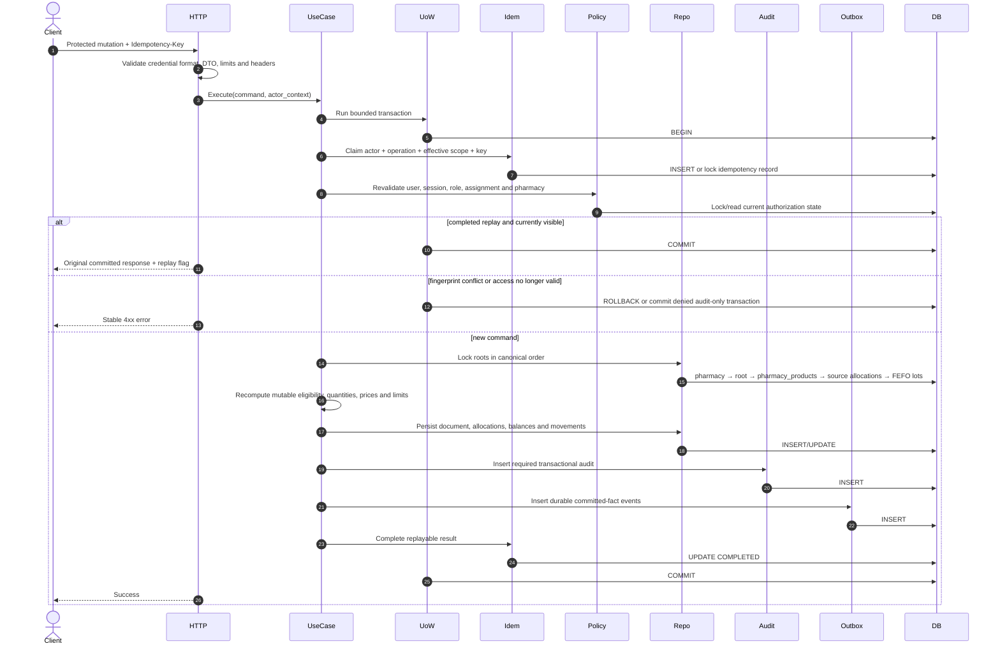

Retryable `40001`/`40P01` повторяет всю transaction function с idempotency claim. Response возвращается только после commit.

## 4. Вход пользователя и создание сессии

Password verification выполняется до mutation transaction. Для отсутствующего пользователя используется заранее подготовленный dummy hash, чтобы внешний timing не раскрывал существование login.

```mermaid
sequenceDiagram
    autonumber
    actor Browser
    participant HTTP
    participant LoginUC
    participant UserRead
    participant Hasher
    participant UoW
    participant UserRepo
    participant SessionRepo
    participant Audit
    participant DB

    Browser->>HTTP: POST /api/v1/auth/login
    HTTP->>HTTP: Validate JSON, size and rate limits
    HTTP->>LoginUC: Authenticate(normalized_login, password, request_context)
    LoginUC->>UserRead: Load authentication snapshot
    UserRead->>DB: SELECT user id, status, password_hash, password_changed_at, version
    DB-->>UserRead: User snapshot or not found
    LoginUC->>Hasher: Verify against real or dummy hash
    Hasher-->>LoginUC: valid / invalid
    alt unknown, invalid or inactive
        LoginUC->>UoW: Record denied security event
        UoW->>DB: BEGIN
        LoginUC->>Audit: Insert non-enumerating denied event
        Audit->>DB: INSERT event
        UoW->>DB: COMMIT
        HTTP-->>Browser: 401 UNAUTHENTICATED
    else credentials valid
        LoginUC->>UoW: Create session transaction
        UoW->>DB: BEGIN
        LoginUC->>UserRepo: Revalidate and lock auth-relevant user state
        UserRepo->>DB: SELECT status, password_changed_at, version FOR UPDATE
        alt user changed or inactive
            LoginUC->>Audit: Record denied due to stale snapshot
            Audit->>DB: INSERT event
            UoW->>DB: COMMIT
            HTTP-->>Browser: 401 UNAUTHENTICATED
        else still valid
            LoginUC->>SessionRepo: Insert session + refresh token hash
            SessionRepo->>DB: INSERT session
            LoginUC->>UserRepo: Record successful login / optional rehash metadata
            UserRepo->>DB: UPDATE auth metadata
            LoginUC->>Audit: Record login success
            Audit->>DB: INSERT event
            UoW->>DB: COMMIT
            LoginUC-->>HTTP: access token + raw refresh token
            HTTP-->>Browser: 200; HttpOnly refresh cookie
        end
    end
```

Инварианты:

- unknown user и invalid password имеют одинаковый внешний ответ;
- raw password и raw refresh token не сохраняются и не логируются;
- session создаётся только после повторной проверки current user state;
- hash upgrade не должен приводить к созданию session при failed audit или failed commit.

## 5. Refresh token rotation и reuse detection

```mermaid
sequenceDiagram
    autonumber
    actor Browser
    participant HTTP
    participant RefreshUC
    participant UoW
    participant SessionRepo
    participant UserRepo
    participant Audit
    participant DB

    Browser->>HTTP: POST /api/v1/auth/refresh + cookie
    HTTP->>RefreshUC: Execute(raw_refresh_token, request_context)
    RefreshUC->>UoW: Run transaction
    UoW->>DB: BEGIN
    RefreshUC->>SessionRepo: Lock token family by opaque selector
    SessionRepo->>DB: SELECT family/generation FOR UPDATE
    RefreshUC->>RefreshUC: Verify hash, generation and expiry
    RefreshUC->>UserRepo: Load current user and role state
    UserRepo->>DB: SELECT current user, session and role state
    alt current generation and active user
        RefreshUC->>SessionRepo: Consume current generation and insert next
        SessionRepo->>DB: UPDATE + INSERT
        RefreshUC->>Audit: Record successful rotation
        Audit->>DB: INSERT event
        UoW->>DB: COMMIT
        RefreshUC-->>HTTP: New access + refresh token
        HTTP-->>Browser: 200; atomically replace cookie
    else previous generation reused
        RefreshUC->>SessionRepo: Revoke complete family
        SessionRepo->>DB: UPDATE family revoked_at
        RefreshUC->>Audit: Record high-severity reuse
        Audit->>DB: INSERT event
        UoW->>DB: COMMIT
        HTTP-->>Browser: 401; clear cookie
    else expired, revoked, invalid or inactive
        RefreshUC->>Audit: Record denied refresh without secret material
        Audit->>DB: INSERT event
        UoW->>DB: COMMIT
        HTTP-->>Browser: 401; clear cookie
    end
```

Два конкурентных refresh request одной generation не могут оба завершиться успешно. Commit должен произойти до выдачи нового cookie.

## 6. Logout текущей сессии

```mermaid
sequenceDiagram
    autonumber
    actor Browser
    participant HTTP
    participant LogoutUC
    participant UoW
    participant SessionRepo
    participant Audit
    participant DB

    Browser->>HTTP: POST /api/v1/auth/logout
    HTTP->>LogoutUC: Execute(session selector, actor context)
    LogoutUC->>UoW: Run transaction
    UoW->>DB: BEGIN
    LogoutUC->>SessionRepo: Lock matching session
    SessionRepo->>DB: SELECT FOR UPDATE
    alt active session
        LogoutUC->>SessionRepo: Revoke session
        SessionRepo->>DB: UPDATE revoked_at/reason
        LogoutUC->>Audit: Record logout
        Audit->>DB: INSERT event
    else missing or already revoked
        LogoutUC->>Audit: Optionally record idempotent logout
        Audit->>DB: INSERT event if policy requires
    end
    UoW->>DB: COMMIT
    HTTP-->>Browser: 204; expire cookie
```

Logout является идемпотентным и не раскрывает существование другой session.

## 7. Блокировка пользователя и отзыв всех сессий

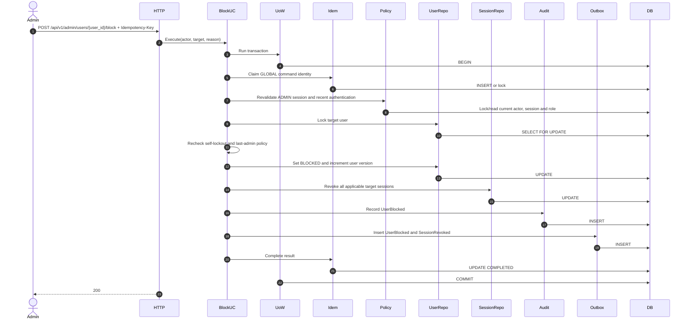

User status, session revocations, audit, outbox и idempotency result атомарны.

## 8. Назначение аптекаря аптеке

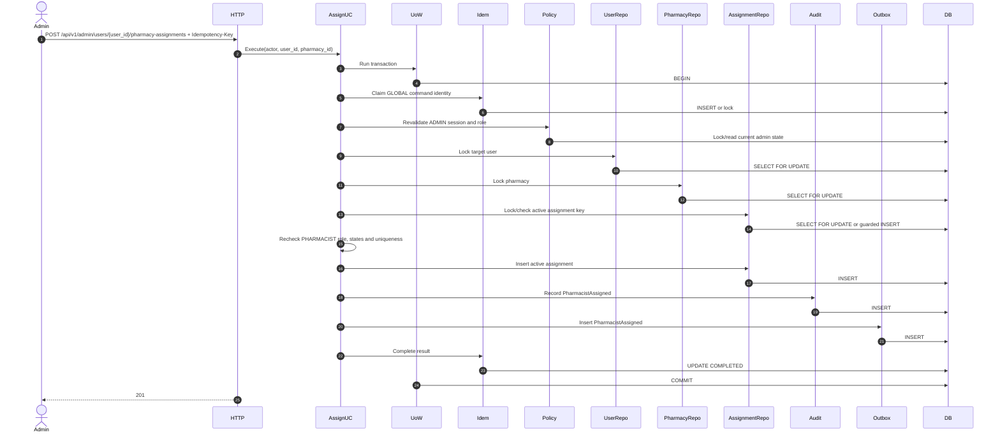

`pharmacy_assignments` принадлежат Pharmacy module; unique constraint защищает от concurrent duplicate assignment.

## 9. Завершение назначения аптекаря

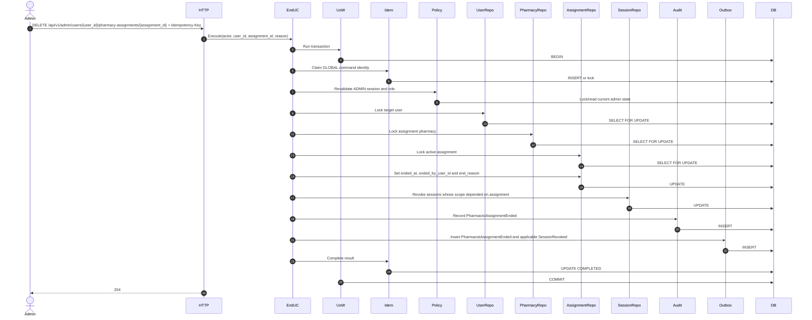

Assignment history не удаляется и не использует отдельный status/version field.

## 10. Проведение поступления

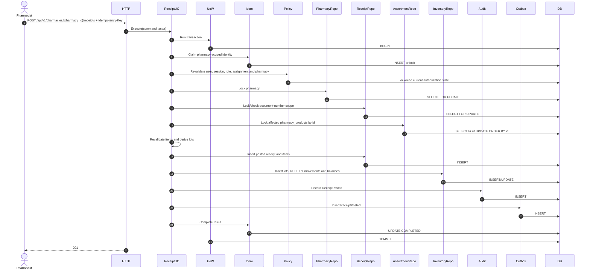

Receipt, lots, movements, audit, outbox и idempotency result commit-ятся атомарно.

## 11. Проведение продажи с FEFO

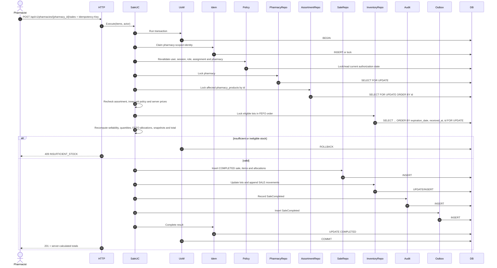

Frontend price, total, lot selection и FEFO allocation не являются authoritative.

## 12. Конкурентная продажа одного остатка

```mermaid
sequenceDiagram
    autonumber
    participant SaleA
    participant SaleB
    participant DB

    par Transaction A
        SaleA->>DB: BEGIN
        SaleA->>DB: Lock lot in canonical order
        DB-->>SaleA: quantity=10, lock acquired
    and Transaction B
        SaleB->>DB: BEGIN
        SaleB->>DB: Lock same lot
        DB-->>SaleB: wait
    end
    SaleA->>DB: UPDATE quantity=0; INSERT movement; COMMIT
    DB-->>SaleB: lock acquired with quantity=0
    SaleB->>SaleB: Recalculate after lock
    SaleB->>DB: ROLLBACK
```

Pre-lock stock check не позволяет списывать товар. Решение принимается только после получения lock и повторного чтения.

## 13. Возврат по исходной продаже

Customer-return endpoint остаётся production-disabled до реализации утверждённой legal/refund policy. После включения он не возвращает customer-returned medicine в sellable stock.

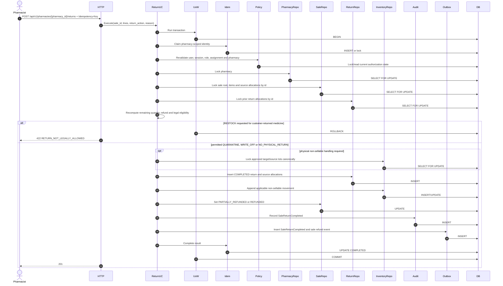

Допустимые `ReturnAction`: `RESTOCK`, `WRITE_OFF`, `QUARANTINE`, `NO_PHYSICAL_RETURN`; customer-return policy запрещает ветвь `RESTOCK`.

## 14. Списание или корректировка

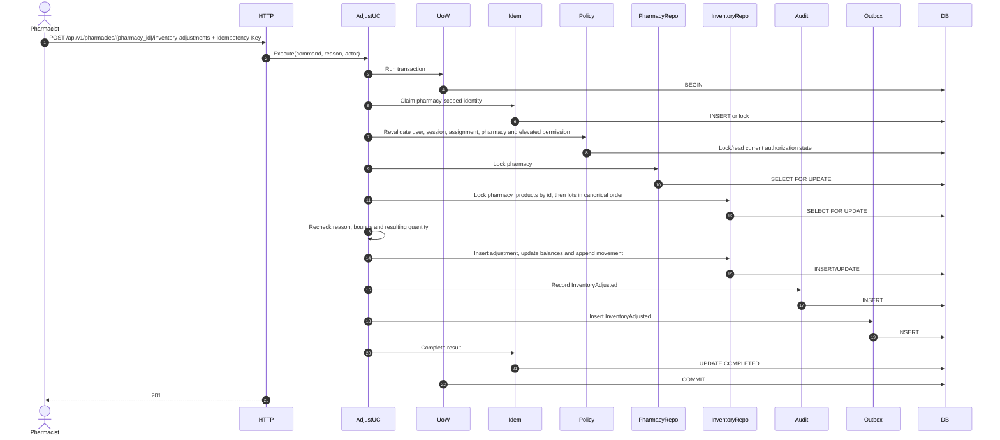

Общий `PATCH stock_quantity` запрещён.

## 15. Сторнирование проведённого документа

Concrete HTTP path определяется resource-specific contract в `05-api-design.md`; generic `{documents}` path не является API.

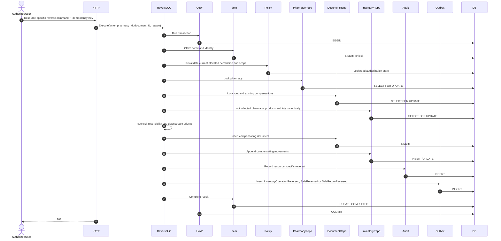

Сторнирование не изменяет исходный документ и не удаляет исходные movements.

## 16. Импорт каталога через quarantine и staging

```mermaid
sequenceDiagram
    autonumber
    actor Admin
    participant HTTP
    participant ImportUC
    participant Storage
    participant UoW
    participant Idem
    participant Policy
    participant ImportRepo
    participant Audit
    participant Outbox
    participant DB
    participant Worker

    Admin->>HTTP: POST /api/v1/admin/catalog-imports + Idempotency-Key
    HTTP->>HTTP: Validate credential, file type, size and limits
    HTTP->>Storage: Stream to quarantine with generated object name
    Storage-->>HTTP: object_id + content_hash
    HTTP->>ImportUC: Create job metadata
    ImportUC->>UoW: Run transaction
    UoW->>DB: BEGIN
    ImportUC->>Idem: Claim GLOBAL command identity
    Idem->>DB: INSERT or lock
    ImportUC->>Policy: Revalidate ADMIN session and role
    Policy->>DB: Lock/read current authorization state
    ImportUC->>ImportRepo: Insert ImportJob state UPLOADED
    ImportRepo->>DB: INSERT
    ImportUC->>Audit: Record catalog import upload
    Audit->>DB: INSERT
    ImportUC->>Idem: Complete 202 response
    Idem->>DB: UPDATE COMPLETED
    UoW->>DB: COMMIT
    HTTP-->>Admin: 202 + job_id

    Worker->>DB: Claim UPLOADED job with SKIP LOCKED
    Worker->>DB: Set VALIDATING
    Worker->>Storage: Read quarantined object as data only
    Worker->>Worker: Parse and validate under bounded limits
    Worker->>DB: BEGIN
    Worker->>DB: Insert staging rows and findings
    alt validation findings exist
        Worker->>DB: Set HAS_ERRORS
    else valid staging
        Worker->>DB: Set READY
    end
    Worker->>DB: COMMIT

    Admin->>HTTP: Confirm selected import rows + Idempotency-Key
    HTTP->>ImportUC: Confirm(job_id, selection)
    ImportUC->>UoW: Run transaction
    UoW->>DB: BEGIN
    ImportUC->>Idem: Claim GLOBAL confirmation identity
    Idem->>DB: INSERT or lock
    ImportUC->>Policy: Revalidate ADMIN session and role
    Policy->>DB: Lock/read current authorization state
    ImportUC->>ImportRepo: Lock READY job and selected rows
    ImportRepo->>DB: SELECT FOR UPDATE; set CONFIRMING
    ImportUC->>ImportRepo: Apply catalog domain commands; set COMPLETED
    ImportRepo->>DB: INSERT/UPDATE
    ImportUC->>Audit: Record CatalogImportCompleted
    Audit->>DB: INSERT
    ImportUC->>Outbox: Insert CatalogImportCompleted
    Outbox->>DB: INSERT
    ImportUC->>Idem: Complete result
    Idem->>DB: UPDATE COMPLETED
    UoW->>DB: COMMIT
```

Persisted states: `UPLOADED`, `VALIDATING`, `READY`, `HAS_ERRORS`, `CONFIRMING`, `COMPLETED`, `FAILED`. Файл не исполняется и staging не публикуется автоматически.

## 17. Публичный поиск лекарства

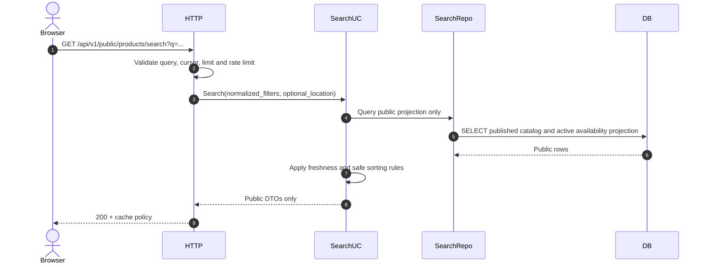

Публичная проекция не содержит exact internal quantity, lot IDs, purchase prices, audit или internal document IDs.

## 18. Идемпотентный replay после успешного commit

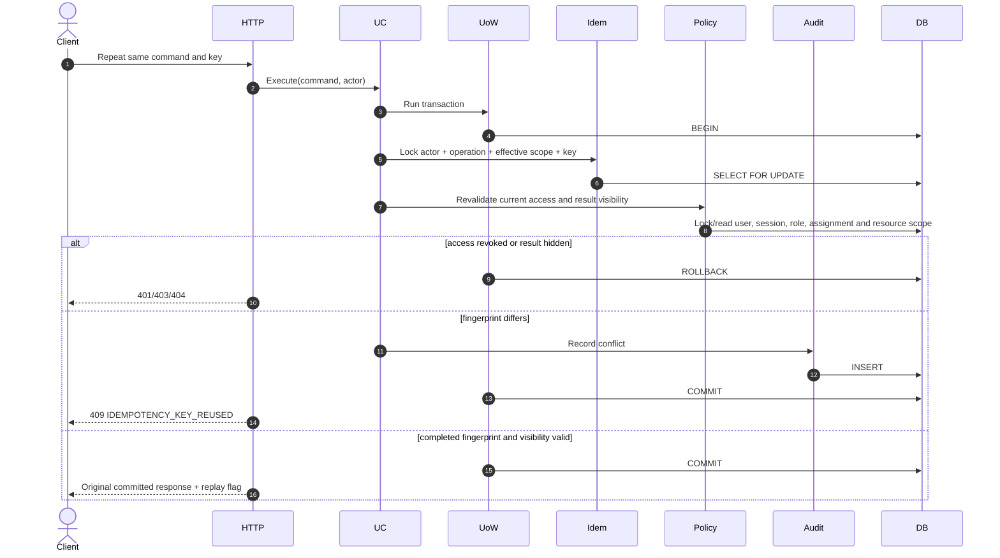

Replay не обходит текущую authorization policy и не раскрывает ресурс, ставший недоступным.

## 19. Serialization failure, deadlock и безопасный retry

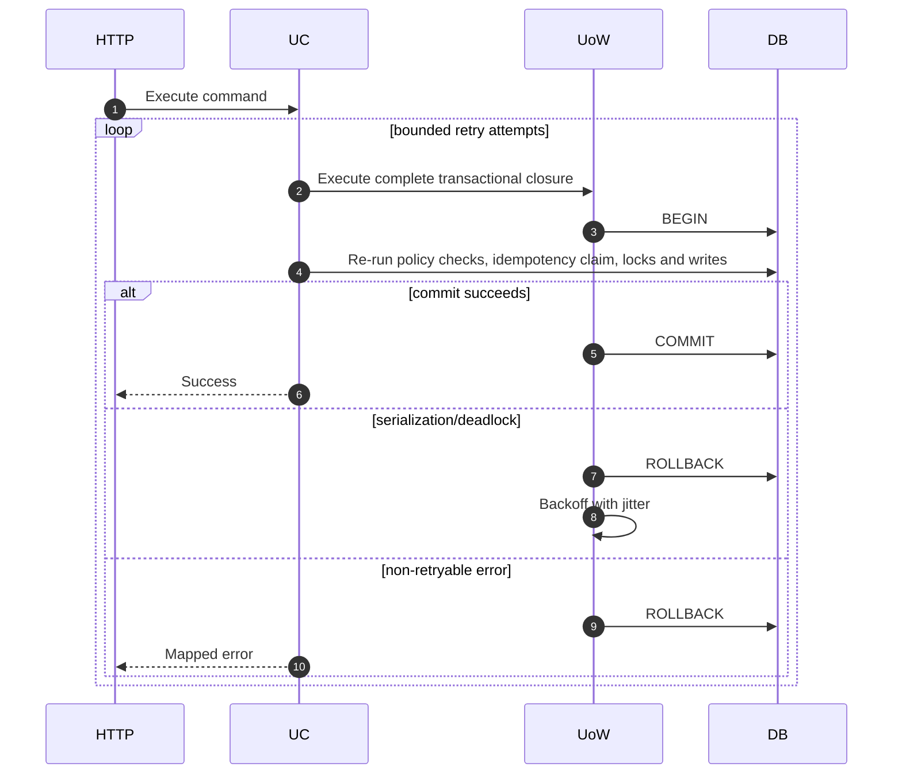

Retry budget, retryable PostgreSQL codes и backoff policy должны быть централизованы. Domain objects и response state пересоздаются для каждой attempt.

## 20. Transactional audit failure

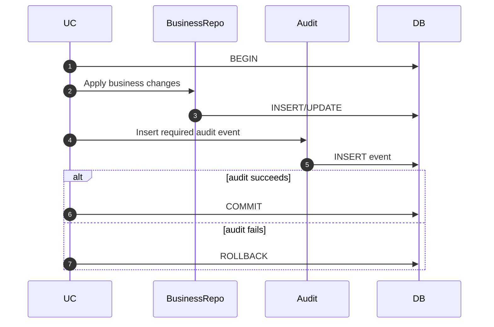

Required audit failure является failure всей операции. Логирование ошибки audit не заменяет rollback.

## 21. Transactional outbox worker

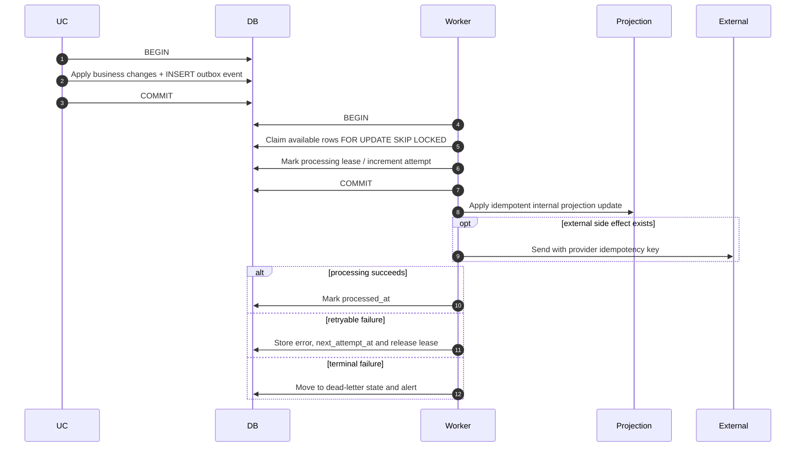

Worker использует at-least-once delivery. Обработчик обязан быть идемпотентным; crash после side effect, но до `processed_at`, не должен создавать повторный необратимый эффект.

## 22. Канонический порядок блокировок

До отдельного ADR применяется единый порядок:

1. idempotency record для конкретной команды;
2. actor user и session, если им требуется lock, а не обычное consistent read;
3. role assignment и pharmacy assignment;
4. pharmacy;
5. основной command document или aggregate root;
6. связанные исходные документы по возрастанию typed ID;
7. stock lots по `(pharmacy_id, product_presentation_id, expiration_date, lot_id)`;
8. dependent rows: allocations, returns, adjustment lines;
9. audit и outbox выполняют inserts и не захватывают business locks в обратном направлении.

Правила:

- одна и та же таблица блокируется в одинаковом порядке во всех use cases;
- набор ID сначала нормализуется, удаляет дубликаты и сортируется;
- policy query не должна случайно брать locks, нарушающие порядок;
- отклонение документируется рядом с use case и покрывается deadlock test;
- lock не удерживается во время network I/O, file parsing, password hashing или ожидания пользователя.

## 23. Поведение idempotency record при ошибке

1. Validation до transaction не создаёт idempotency record.
2. Business rejection без side effect обычно rollback-ит новый claim; клиент может исправить payload и использовать новый key.
3. Fingerprint conflict сохраняет security event, но не заменяет исходный result.
4. Serialization/deadlock rollback не оставляет частично completed record.
5. После commit record содержит stable status, response snapshot и resource reference.
6. Неопределённое состояние после network disconnect разрешается повтором того же key.
7. `FAILED` record допускается только для результата, который по контракту должен детерминированно replay-иться; эта политика фиксируется endpoint-specific.

## 24. Негативные и конкурентные последовательности для тестов

Минимально проверяются:

- token криптографически валиден, но user blocked;
- session revoked между middleware и transaction policy check;
- role или assignment отозваны одновременно с mutation;
- target resource принадлежит другой pharmacy;
- два refresh request используют одну generation;
- login user state меняется после password verification, но до session insert;
- logout повторяется для already revoked session;
- concurrent duplicate assignment;
- idempotency replay после отзыва доступа;
- same key с другим semantic payload;
- disconnect после commit и безопасный replay;
- две продажи конкурируют за один lot;
- sale конкурирует с write-off того же lot;
- два returns конкурируют за одну sale allocation;
- reversal конкурирует с другим reversal;
- required audit insert завершается ошибкой;
- commit получает serialization failure;
- retry исчерпывает budget;
- worker падает после side effect, но до `processed_at`;
- worker повторно получает одно outbox event;
- import содержит oversized file, traversal filename, malformed rows, archive bomb или CSV formula;
- frontend получает late success после logout или auth generation change.

## 25. Definition of Done критического сценария

Сценарий считается согласованным, если:

1. определены actor, target resource и effective pharmacy scope;
2. показано, где выполняются authentication и authorization;
3. stale-sensitive checks находятся внутри mutation transaction;
4. transaction boundary совпадает с Domain Model и Database Design;
5. lock order соответствует каноническому порядку;
6. дорогие или внешние операции вынесены за пределы lock-holding transaction;
7. idempotency scope, fingerprint и error-state policy определены;
8. commit/rollback показаны во всех ветвях;
9. required audit входит в transaction boundary;
10. reliable post-commit event записывается через outbox;
11. внешний success возвращается только после commit;
12. replay, race, retry, disconnect и rollback paths покрыты тестами;
13. ошибки проходят через централизованный mapper;
14. диаграмма не передаёт `gin.Context`, `pgx.Tx` или SQL models через application/domain API;
15. sequence diagram, API contract, repository behavior и integration test не противоречат друг другу.

## 26. Remaining sequence implementation decisions

1. endpoint-specific policy сохранения deterministic stable 4xx idempotency results;
2. public projection freshness/SLA;
3. elevated dual approval для risk-heavy ADMIN operations;
4. scoped versus all-session revoke для будущей multi-assignment model;
5. catalog publish atomic/partial sequence.

Lock order, idempotency-first protocol, retry budget, outbox lease/fencing, auth/session invalidation, API paths, states, enums и legal return baseline закрыты Gate E0 и не являются открытыми вариантами.
